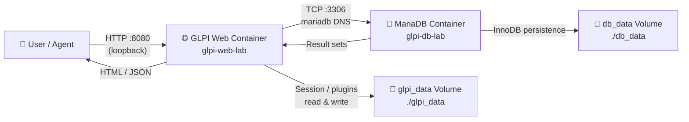
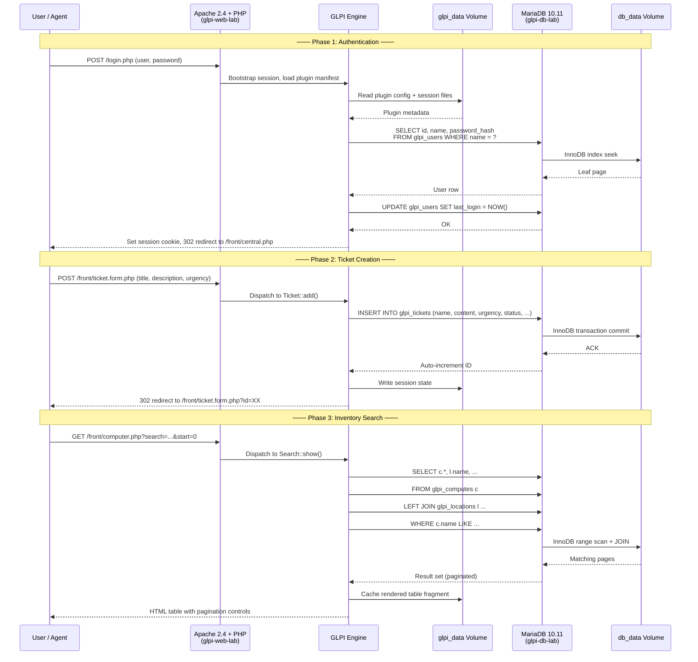
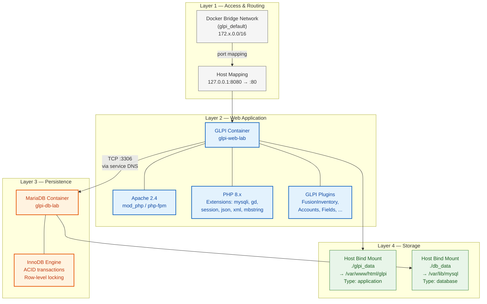
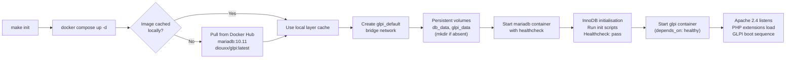
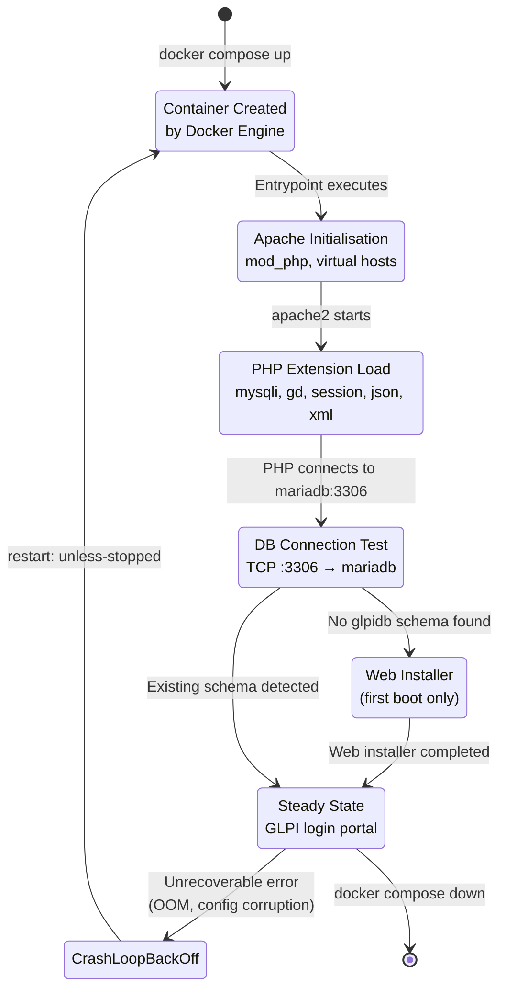

# GLPI — IT Asset Management Stack

Production-grade containerized deployment of [GLPI](https://glpi-project.org/), the enterprise open-source IT Asset Management, Help Desk, and Service Desk platform, backed by MariaDB with health-checked dependency orchestration.

This stack provides a fully isolated, reproducible environment orchestrated via Docker Compose and managed through a unified Makefile interface. Secrets are externalised via `.env`, the web interface is loopback-bound by default, and the database container must pass a built-in healthcheck before the application container starts — eliminating race conditions on first boot.

---

## Key Features

- **Full GLPI Suite** — IT inventory, incident tracking, change management, reporting, and asset lifecycle management
- **MariaDB 10.11 Backend** — Purpose-configured relational storage with health-checked startup coordination and persistent volume mounts
- **Secrets Externalised** — All credentials sourced from `.env` (gitignored); no hardcoded secrets in the compose manifest
- **Localhost-Bound by Default** — GLPI web interface binds exclusively to `127.0.0.1:8080`, reducing the attack surface on shared hosts and lab environments
- **Native Healthcheck Gating** — GLPI container waits for MariaDB to pass `healthcheck.sh --connect --innodb_initialized` before starting
- **One-command Bootstrap** — `make init` creates data directories and deploys the entire stack
- **Granular Lifecycle Management** — Makefile targets for `up`, `down`, `restart`, `logs`, `status`, and `clean`
- **Timezone-Aware** — Configurable via `TIMEZONE` environment variable (default: `Europe/Madrid`)
- **Compose Lint Compliance** — Clean `docker compose config` validation; no warnings on orphan or dependency resolution
- **Audit-Ready Documentation** — Full Mermaid architecture diagrams, security posture notes, and file-by-file guide

---

## Technical Stack

| Component         | Technology                           |
|-------------------|--------------------------------------|
| **Web App**       | GLPI (`diouxx/glpi:latest`)          |
| **Database**      | MariaDB 10.11                        |
| **Orchestration** | Docker Compose (v3.8)                |
| **Automation**    | GNU Make >= 4.0                      |
| **Secret Mgmt**   | `.env` file (externalised)           |

---

## 🚶 Diagram Walkthrough

The flowchart below captures the end-to-end traversal of a user request through the stack, from network ingress to database persistence and back.



| Step | Source | Target | Action |
|------|--------|--------|--------|
| 1 | User | GLPI Web | HTTP request on `127.0.0.1:8080` |
| 2 | GLPI Web | glpi_data Volume | Load PHP session, plugin config, cached templates |
| 3 | GLPI Web | MariaDB | SQL queries (auth, CRUD, search) |
| 4 | MariaDB | db_data Volume | InnoDB page reads and writes |
| 5 | MariaDB | GLPI Web | Return result sets |
| 6 | GLPI Web | glpi_data Volume | Write session state, cache fragments |
| 7 | GLPI Web | User | Rendered HTML page or JSON payload |

---

## 🗺️ System Workflow

The sequence diagram models the three canonical operations in a GLPI session — authentication, ticket creation, and inventory search — showing every cross-component interaction.



---

## 🏗️ Architecture Components

The system decomposes into four logical layers. The diagram below shows the static structure and dependency graph of every runtime component, from the Docker network down to the filesystem.



### Layer Responsibilities

| Layer | Components | Function |
|-------|------------|----------|
| **Access** | Docker bridge network, host port 127.0.0.1:8080 | Routes external traffic into the container namespace; loopback binding blocks remote access |
| **Web Application** | Apache 2.4, PHP 8.x with extensions, GLPI engine, community plugins | Serves the web UI, executes business logic (tickets, inventory, reporting), applies middleware |
| **Persistence** | MariaDB 10.11, InnoDB storage engine | Stores all relational data: users, tickets, computers, software licenses, configurations |
| **Storage** | Host bind mounts (`./glpi_data`, `./db_data`) | Preserves state across container restarts and rebuilds; gitignored to prevent credential leakage |

---

## ⚙️ Container Lifecycle

### Build Process

This stack consumes pre-built Docker images, so the "build" phase is a pull-and-deploy cycle orchestrated by Compose. No custom Dockerfile is involved.



**Key steps:**

1. **Image resolution** — Compose resolves `mariadb:10.11` and `diouxx/glpi:latest`. If absent locally, they are pulled from Docker Hub.
2. **Network provisioning** — A dedicated bridge network is created with embedded DNS resolution (service name → container IP).
3. **Volume preparation** — Host directories `./db_data` and `./glpi_data` are created if missing (handled by `make init`).
4. **Database bootstrap** — MariaDB starts first, initialises the InnoDB data directory, and executes the `MARIADB_*` environment variables to create the `glpidb` schema and `glpi_user` account.
5. **Healthcheck gating** — Docker runs `healthcheck.sh --connect --innodb_initialized` every 10s (up to 5 retries). The GLPI container only starts after this passes.
6. **Application bootstrap** — Apache and PHP start inside the GLPI container. If no database schema exists, the web installer is presented to the user.

### Runtime Process



**Startup sequence in detail:**

1. **Container creation** — Docker Engine allocates the container cgroup, mounts volumes, and sets up the network namespace.
2. **Apache initialisation** — The entrypoint (`apache2-foreground`) launches Apache 2.4, loads `mod_php`, parses virtual host configuration, and opens port 80.
3. **PHP extension loading** — PHP enables `mysqli`, `gd`, `session`, `json`, `xml`, and `mbstring` via `php.ini` configuration.
4. **Database handshake** — GLPI attempts a MySQL connection to the `mariadb` hostname on port 3306. On first boot, no schema exists, so the installer flow is triggered.
5. **Steady state** — After the web installer completes, every subsequent restart immediately serves the full GLPI application.
6. **Fault recovery** — If either container exits unexpectedly, `restart: unless-stopped` re-creates it. After 5 consecutive healthcheck failures MariaDB is marked unhealthy and the GLPI container will not start.

---

## 📂 File-by-File Guide

| Path | Type | Purpose |
|------|------|---------|
| `docker-compose.yml` | Compose manifest | Declares the two services (`mariadb`, `glpi`) with healthcheck gating, environment injection, volume mounting, and loopback port binding |
| `Makefile` | Build automation | GNU Make wrapper around Compose; provides `init`, `up`, `down`, `restart`, `logs`, `status`, `logs-db`, `logs-web`, and `clean` targets with coloured output |
| `.env.example` | Environment template | Template for externalised secrets (`MARIADB_ROOT_PASSWORD`, `MARIADB_PASSWORD`, `TIMEZONE`); safe to commit |
| `.gitignore` | Git exclusion rules | Prevents `.env`, `db_data/`, `glpi_data/`, IDE artifacts, and log files from being tracked |
| `README.md` | Documentation | This file — architecture guide, configuration reference, and operational manual |
| `db_data/` | Directory (auto) | MariaDB InnoDB data directory. Created on first `make init`. **Do not modify manually.** Gitignored. |
| `glpi_data/` | Directory (auto) | GLPI application runtime files: plugins, uploaded documents, sessions, cached templates. Created on first `make init`. Gitignored. |

---

## Installation & Setup

### Prerequisites

- Docker Engine >= 24.x
- Docker Compose plugin (v2) or standalone `docker-compose`
- GNU Make >= 4.0

### Step-by-Step

```bash
# 1. Clone the repository
git clone git@github.com:Selio30/imagenesDocker.git
cd imagenesDocker/GLPI

# 2. Create the environment file from the safe template
cp .env.example .env

# 3. Edit .env with your own secrets:
#    - MARIADB_ROOT_PASSWORD (change the default)
#    - MARIADB_PASSWORD      (change the default)
#    - TIMEZONE              (optional, defaults to Europe/Madrid)

# 4. Deploy the stack — creates data dirs and starts containers
make init

# 5. Confirm both services are healthy
make status
```

The GLPI web interface is now available at [http://localhost:8080](http://localhost:8080).

> **First-time setup:** Complete the GLPI web installer with the database credentials declared in your `.env`:
> - **SQL Server:** `mariadb` (Docker internal DNS)
> - **SQL User:** `glpi_user`
> - **SQL Password:** *(value of `MARIADB_PASSWORD`)*
> - **Database:** `glpidb`

---

## Configuration

### Environment Variables (`.env`)

All sensitive configuration is externalised. Copy `.env.example` to `.env` and populate:

| Variable                  | Default                  | Description                    |
|---------------------------|--------------------------|--------------------------------|
| `MARIADB_ROOT_PASSWORD`   | `cambiame_root_password` | MariaDB root password          |
| `MARIADB_DATABASE`        | `glpidb`                 | GLPI database name             |
| `MARIADB_USER`            | `glpi_user`              | GLPI application database user |
| `MARIADB_PASSWORD`        | `cambiame_glpi_password` | GLPI application password      |
| `TIMEZONE`                | `Europe/Madrid`          | Application time zone          |

> The `.env` file is excluded from version control (`.gitignore`). Only `.env.example` — which contains placeholder values — is committed.

### Port Mapping

| Host Address | Host Port | Container Port | Service |
|--------------|-----------|----------------|---------|
| `127.0.0.1`  | `8080`    | `80`           | GLPI    |

### Persistent Volumes

| Host Path      | Container Path          | Owner   |
|----------------|-------------------------|---------|
| `./db_data`    | `/var/lib/mysql`        | MariaDB |
| `./glpi_data`  | `/var/www/html/glpi`    | GLPI    |

### Healthcheck (MariaDB)

```yaml
test: ["CMD", "healthcheck.sh", "--connect", "--innodb_initialized"]
interval: 10s
timeout: 5s
retries: 5
```

The GLPI service uses `depends_on: mariadb: condition: service_healthy` to guarantee it never starts before the database is ready for connections.

---

## Usage

### Makefile Commands

| Command        | Description                                |
|----------------|--------------------------------------------|
| `make help`    | Display available commands and services    |
| `make init`    | Create data directories and deploy stack   |
| `make up`      | Start all containers (detached)            |
| `make down`    | Stop and remove all containers             |
| `make restart` | Restart all services                       |
| `make status`  | Show container status                      |
| `make logs`    | Tail logs from all services (last 50 lines)|
| `make logs-db` | Tail logs from MariaDB only                |
| `make logs-web`| Tail logs from GLPI web only               |
| `make clean`   | Down with orphan removal; data preserved   |

### Typical Workflow

```bash
# First deployment
cp .env.example .env
# (edit .env with secure passwords)
make init
make status

# Daily operations
make logs-web
make logs-db

# Maintenance
make down
make up

# Full teardown (preserves data)
make clean

# Complete reset (destroys volumes)
rm -rf db_data glpi_data
```

---

## Author

**Sergio Barbero — Selio30**  
[](https://www.linkedin.com/in/Selio30/)
