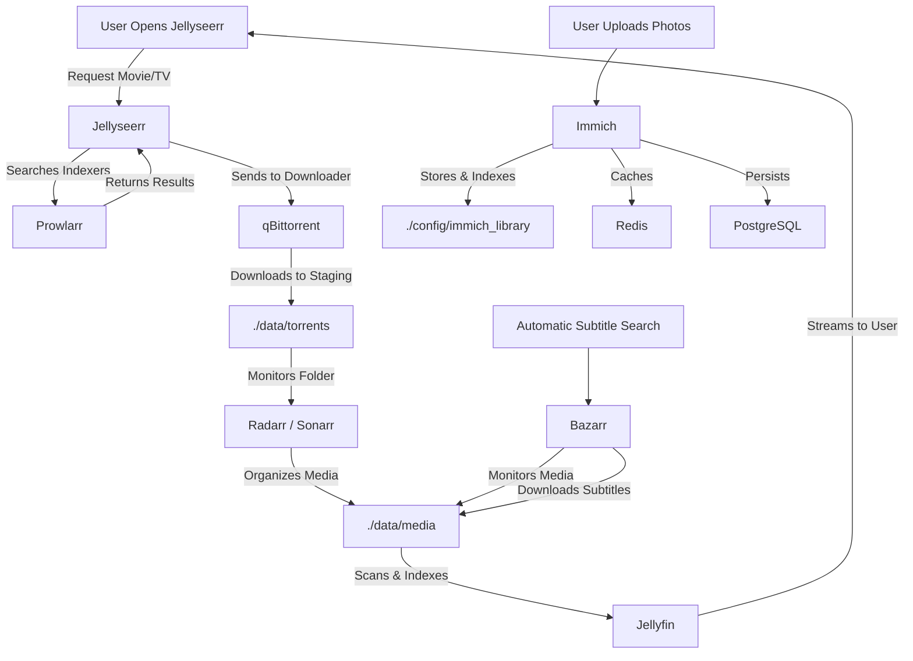
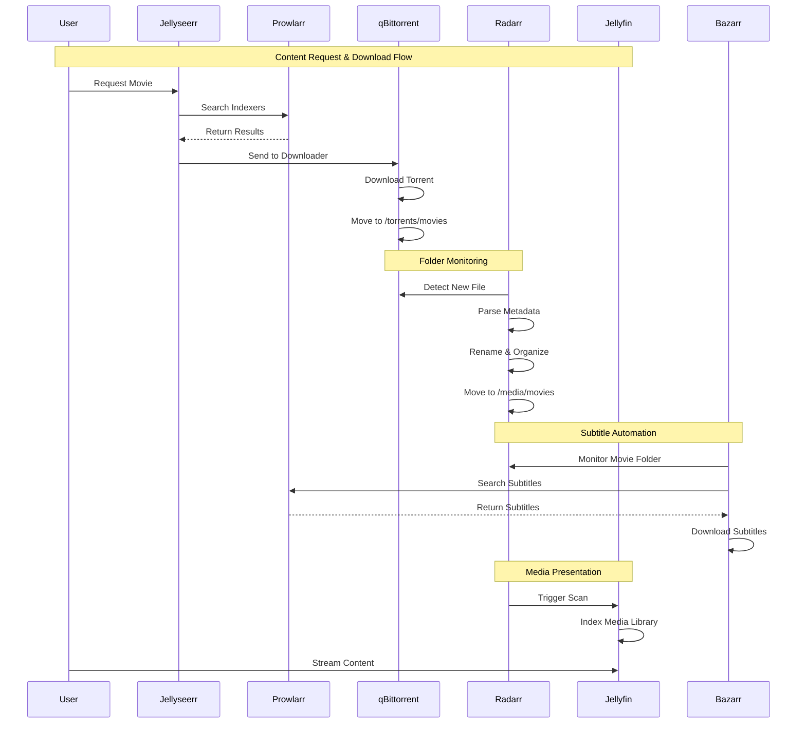
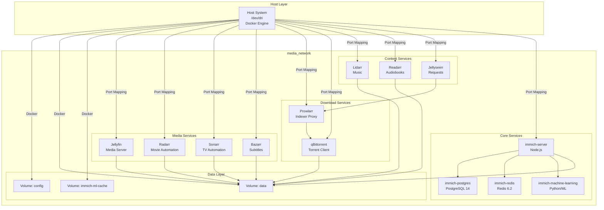
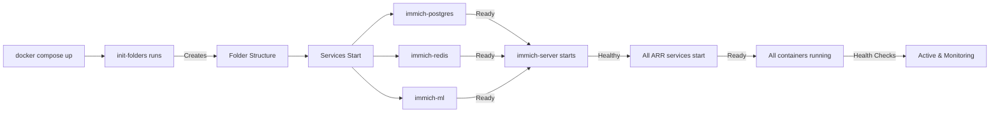
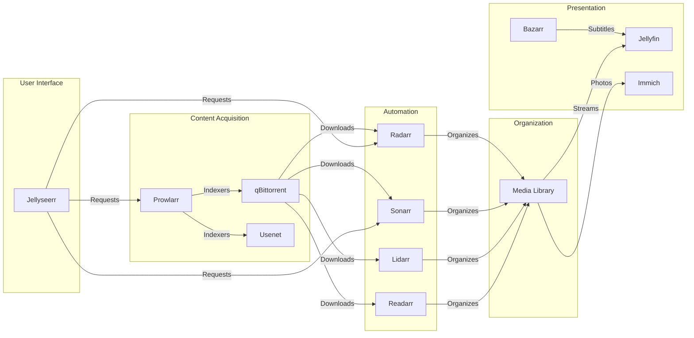
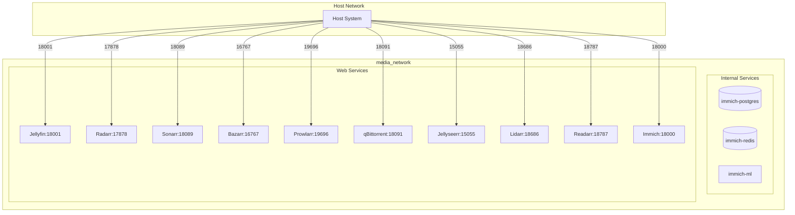

# MediaStack — Self-Hosted Media Server Infrastructure

## Project Identity

**MediaStack** is a production-ready, containerized media server infrastructure designed for home lab environments. It provides a complete ecosystem for managing, downloading, and streaming multimedia content including movies, TV shows, music, books, and personal photos.

Built on Docker Compose and orchestrated via a Makefile-based CLI, MediaStack delivers a secure-by-default deployment with non-standard ports, network isolation, and persistent volume management.

## Key Features

- **Complete Media Pipeline**: Integrated ecosystem from content acquisition (Prowlarr, qBittorrent) through management (Radarr, Sonarr, Lidarr, Readarr) to presentation (Jellyfin, Immich)
- **Secure by Default**: Non-standard external ports to avoid port scanning; LAN-only accessible interfaces; no exposed default services
- **Automated Storage Structure**: Pre-configured folder hierarchy for torrents, usenet, and media organized by content type
- **Hardware Acceleration**: Intel QuickSync passthrough for hardware-accelerated transcoding in Jellyfin
- **Production-Ready**: Health checks, restart policies, dependency management, and centralized logging
- **CLI-Driven Operations**: Makefile-based commands for deployment, monitoring, updates, and troubleshooting
- **Network Isolation**: All services run in a dedicated Docker network (`media_network`) with internal service discovery

## Technical Stack

| Component | Technology | Purpose |
|-----------|------------|---------|
| Container Runtime | Docker Engine + Compose | Service orchestration |
| Base Images | LinuxServer.io | Consistent, hardened container images |
| Media Server | Jellyfin | Media streaming and transcoding |
| Photo Management | Immich | Self-hosted Google Photos alternative |
| Indexers & Downloaders | Prowlarr, qBittorrent | Content acquisition |
| Media Management | Radarr (Movies), Sonarr (TV) | Automation and organization |
| Music & Books | Lidarr, Readarr | Audiobook and music management |
| Subtitles | Bazarr | Automated subtitle downloading |
| Request Management | Jellyseerr | User-friendly content requests |
| Database | PostgreSQL 14 (pgvecto.rs) | Immich persistent storage & ML features |
| Cache | Redis 6.2 | Immich caching layer |

---

## 🚶 Diagram Walkthrough



---

## 🗺️ System Workflow



---

## 🏗️ Architecture Components



---

## ⚙️ Container Lifecycle

### Build Process

The MediaStack does not require building custom images—all services use pre-built LinuxServer.io and official images:

1. **Image Pull**: `docker compose pull` fetches latest images from Docker Hub/GHCR
2. **Network Creation**: `media_network` is created if not existing
3. **Volume Initialization**: Named volumes (`immich-ml-cache`) are created
4. **Container Creation**: All containers are created from pulled images

### Runtime Process



**Runtime Initialization Sequence:**

1. **init-folders**: Creates directory structure in `./data/`
2. **Database Services**: `immich-postgres` and `immich-redis` start first
3. **Core Services**: `immich-machine-learning` and `immich-server` start
4. **ARR Services**: Radarr, Sonarr, Lidarr, Readarr start
5. **Media Services**: Jellyfin, Bazarr start
6. **Download Services**: Prowlarr, qBittorrent start
7. **UI Services**: Jellyseerr starts

---

## 📂 File-by-File Guide

| File/Folder | Description |
|------------|-------------|
| **docker-compose.yml** | Main service orchestration file defining all containers, networks, volumes, and port mappings |
| **Makefile** | CLI commands for deployment, monitoring, updates, and shell access |
| **.env** | Environment variables for database configuration (auto-generated on first run) |
| **README.md** | This technical documentation file |
| **config/** | Persistent storage for all service configurations |
| config/immich_db/ | PostgreSQL data directory for Immich |
| config/immich_library/ | Uploaded photos storage for Immich |
| config/jellyfin/ | Jellyfin configuration, metadata, and transcode cache |
| config/radarr/ | Radarr database, config.xml, and custom scripts |
| config/sonarr/ | Sonarr database, config.xml, and custom scripts |
| config/bazarr/ | Bazarr database and configuration |
| config/prowlarr/ | Prowlarr indexer configuration and database |
| config/qbittorrent/ | qBittorrent config, downloads, and WebUI data |
| config/lidarr/ | Lidarr database and configuration |
| config/readarr/ | Readarr database and configuration |
| config/seerr/ | Jellyseerr database and configuration |
| **data/** | Shared media storage across all services |
| data/media/ | Final organized media library (movies, TV, music, books) |
| data/torrents/ | Incomplete downloads staging area |
| data/usenet/ | Usenet downloads (incomplete and complete) |

---

## Installation & Setup

### Prerequisites

- Docker Engine ≥ 20.10
- Docker Compose ≥ 2.0
- GNU Make ≥ 4.0
- 4+ GB RAM recommended
- Intel iGPU for hardware transcoding (optional)

### Quick Start

**1. Clone the Repository**
```bash
git clone git@github.com:Selio30/imagenesDocker.git
cd imagenesDocker/MediaStack
```

**2. Initialize and Deploy**
The first run requires initializing the core folder structure and generating the `.env` file automatically:
```bash
make init
```

**3. Verify Deployment**
Check that all containers are running and healthy:
```bash
make status
make logs
```

### Environment Configuration

The `.env` file is auto-generated on the first run with the following variables:

```bash
# Immich Database Configuration
DB_PASSWORD=change_me              # Change immediately in production
DB_USERNAME=postgres
DB_DATABASE_NAME=immich
DB_HOSTNAME=immich-postgres        # Internal service name
```

> **Security Note**: Always change `DB_PASSWORD` in your `.env` file before exposing the services in a production environment.

## Architecture & Workflow

### File Tree

```
MediaStack/
├── .env                    # Environment variables (gitignored)
├── docker-compose.yml      # Service definitions
├── Makefile               # CLI operations
├── README.md              # Technical documentation
├── config/                # Persistent service configurations
│   ├── immich_library/   # Immich uploaded photos
│   ├── immich_db/         # PostgreSQL data
│   ├── jellyfin/          # Jellyfin config
│   ├── radarr/            # Radarr config
│   ├── sonarr/            # Sonarr config
│   ├── bazarr/            # Bazarr config
│   ├── prowlarr/          # Prowlarr config
│   ├── qbittorrent/       # qBittorrent config
│   ├── lidarr/            # Lidarr config
│   ├── readarr/           # Readarr config
│   └── seerr/             # Jellyseerr config
└── data/                  # Media storage (shared across services)
    ├── media/             # Final media library
    │   ├── movies/
    │   ├── tv/
    │   ├── music/
    │   └── books/
    ├── torrents/          # Incomplete downloads
    │   ├── movies/
    │   ├── tv/
    │   ├── music/
    │   └── books/
    └── usenet/            # Usenet downloads
        ├── incomplete/
        └── complete/
```

### System Workflow (Legacy)



**Data Flow Description:**

1. **Discovery**: Prowlarr queries indexers for content availability
2. **Download**: qBittorrent pulls torrents/usenet files to staging areas
3. **Processing**: Radarr/Sonarr/Lidarr/Readarr monitor folders and organize media
4. **Subtitles**: Bazarr searches and downloads subtitles for media files
5. **Presentation**: Jellyfin streams organized media; Immich manages photos
6. **Requests**: Jellyseerr provides a web UI for users to request content

### Network Architecture

All services communicate via the `media_network` Docker network. Services that require external access expose ports on the host with non-standard values:



## Configuration

### Port Mapping

| Service | External Port | Internal Port | Description |
|---------|---------------|---------------|--------------|
| Jellyfin | 18001 | 8096 | Media streaming |
| Radarr | 17878 | 7878 | Movie management |
| Sonarr | 18089 | 8989 | TV series management |
| Bazarr | 16767 | 6767 | Subtitle downloading |
| Prowlarr | 19696 | 9696 | Indexer proxy |
| qBittorrent | 18091 | 8080 | Torrent client |
| qBittorrent P2P | 16881 | 6881 | BitTorrent protocol |
| Jellyseerr | 15055 | 5055 | User requests |
| Lidarr | 18686 | 8686 | Music management |
| Readarr | 18787 | 8787 | Audiobook management |
| Immich | 18000 | 2283 | Photo management |

### Service Communication

Internal services communicate using Docker DNS names:
- `immich-server` → `immich-postgres:5432`
- `immich-server` → `immich-redis:6379`

External services connect via localhost on their assigned ports.

## Usage

### Makefile Commands

```bash
make help              # Display available commands
make init              # First-time setup: create folders + deploy
make up                # Start all services
make down              # Stop all services
make restart           # Restart all services
make status            # Show service status
make logs              # Stream live logs
make logs-media        # Jellyfin logs only
make logs-arr          # Radarr/Sonarr logs
make logs-downloads    # qBittorrent/Prowlarr logs
make logs-immich       # Immich logs
make update            # Pull latest images and redeploy
make clean             # Prune unused Docker resources
```

### Shell Access

```bash
make shell-jellyfin      # Access Jellyfin container
make shell-radarr        # Access Radarr container
make shell-sonarr       # Access Sonarr container
make shell-qbittorrent  # Access qBittorrent container
make shell-immich       # Access Immich server
make shell-lidarr       # Access Lidarr container
make shell-bazarr       # Access Bazarr container
make shell-prowlarr     # Access Prowlarr container
make shell-seerr        # Access Jellyseerr container
```

### Accessing Services

After deployment, access services at:

```
http://localhost:18001      # Jellyfin
http://localhost:17878      # Radarr
http://localhost:18089      # Sonarr
http://localhost:16767      # Bazarr
http://localhost:18686     # Lidarr
http://localhost:18787     # Readarr
http://localhost:19696     # Prowlarr
http://localhost:18091     # qBittorrent WebUI
http://localhost:15055     # Jellyseerr
http://localhost:18000     # Immich
```

For LAN access, replace `localhost` with the server's IP address.

## Security Considerations

- **Non-standard ports**: Reduces exposure to automated scanning
- **No default credentials**: Services use LinuxServer.io defaults; change on first access
- **Network isolation**: Services cannot access each other outside the defined network
- **Environment variables**: `.env` contains no hardcoded production secrets
- **Hardware passthrough**: `/dev/dri` requires proper permissions on the host

## Maintenance

### Backup

Back up the following directories regularly:
- `./config/` — All service configurations and databases
- `./data/` — Media library (may be large)
- `./.env` — Environment configuration

### Updates

```bash
make update  # Pull latest images and restart
```

---

## Author

**Sergio Barbero** - [Selio30](https://www.linkedin.com/in/Selio30)

---

*MediaStack — Self-hosted media infrastructure for the modern home lab*
