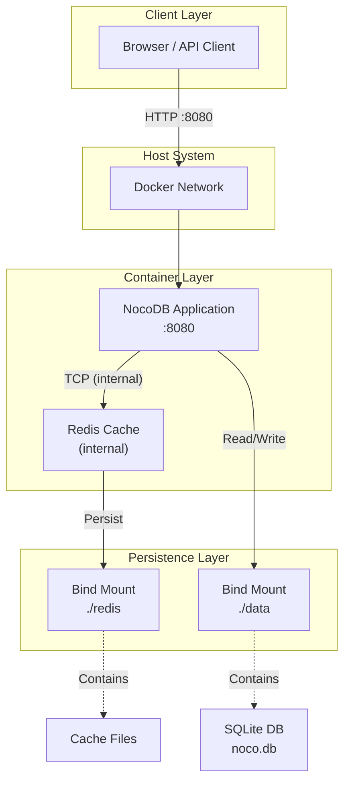
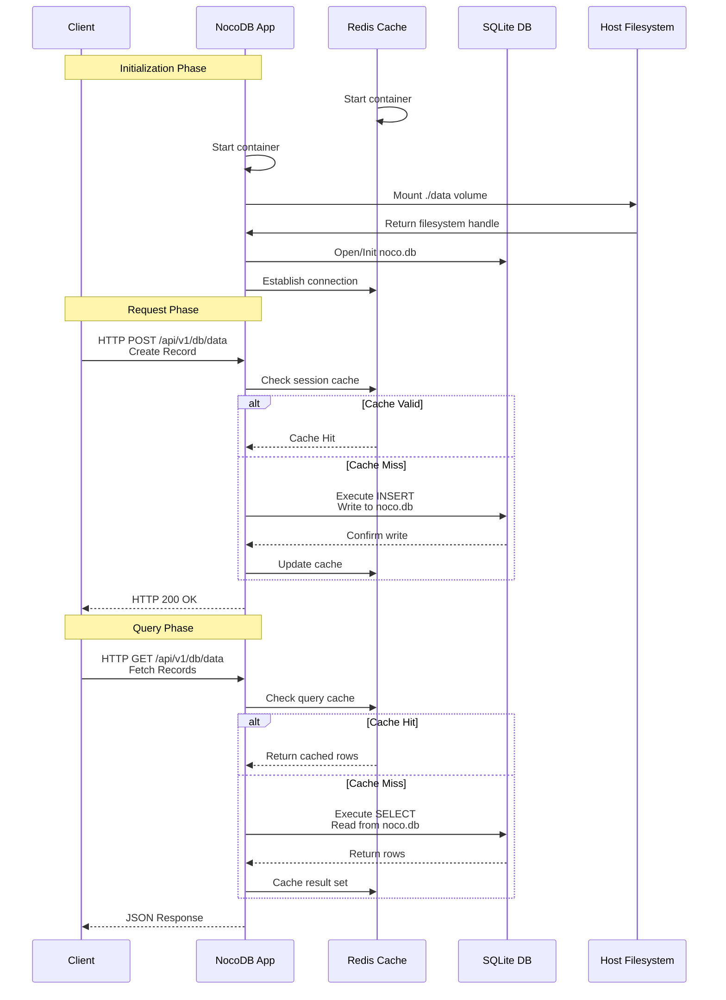
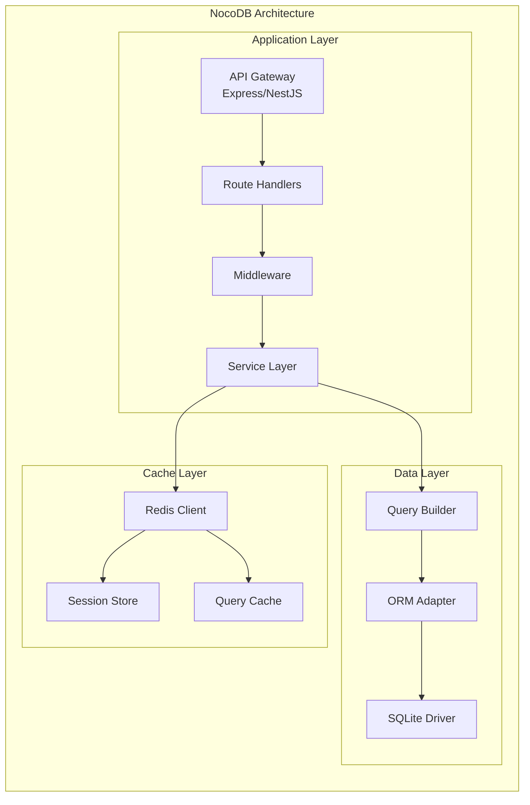

# NocoDB Production Deployment

Enterprise-grade self-hosted no-code platform backed by persistent storage and caching layer.

## Overview

This repository provides a production-ready Docker Compose architecture for deploying **NocoDB**, an open-source no-code platform that transforms SQL databases into smart collaborative worksheets. The infrastructure leverages Redis for session caching and bind-mounted volumes for data durability, ensuring operational continuity and rapid recovery.

## Key Features

- **Self-Hosted Airtable Alternative**: Full no-code database platform with spreadsheet interface
- **Redis Caching Layer**: High-speed in-memory cache for session management and query optimization
- **Persistent Data Storage**: Bind-mounted directories for application data and cache persistence
- **Container Orchestration**: Docker Compose for simplified deployment and operational management
- **Production-Ready**: Configured with restart policies and health monitoring
- **Clean Architecture**: Separation between application data (`data/`) and cache (`redis/`)

## Technical Stack

| Component | Technology | Version |
|-----------|------------|---------|
| Application | NocoDB | Latest (stable) |
| Cache | Redis | 7 (Alpine) |
| Container Runtime | Docker Engine | 20.x+ |
| Orchestration | Docker Compose | 2.x+ |

### Prerequisites

- Docker Engine 20.10 or higher
- Docker Compose v2.0 or higher
- 4GB RAM minimum (8GB recommended)
- 20GB available storage
- Port 8080 available

---

## 1. 🚶 Diagram Walkthrough



---

## 2. 🗺️ System Workflow



---

## 3. 🏗️ Architecture Components



---

## 4. ⚙️ Container Lifecycle

### 4.1 Build Process

| Step | Action | Description |
|------|--------|--------------|
| 1 | `docker compose pull` | Pull base images (nocodb:latest, redis:7-alpine) |
| 2 | `docker compose create` | Create containers from images |
| 3 | Volume binding | Map `./data` → `/usr/app/data` |
| 4 | Volume binding | Map `./redis` → `/data` |
| 5 | Network config | Create internal Docker network |

### 4.2 Runtime Process

```
NocoDB Container Startup:
├── 1. Init process (dumb-init)
├── 2. Load environment variables (NC_TOOL_DIR)
├── 3. Mount volume ./data -> /usr/app/data
├── 4. Check/create SQLite database (noco.db)
├── 5. Initialize NestJS application
├── 6. Start internal proxy server (port 5433)
├── 7. Listen on HTTP port 8080
└── ✓ Ready for requests

Redis Container Startup:
├── 1. Entry point (docker-entrypoint.sh)
├── 2. Load Redis configuration
├── 3. Mount volume ./redis -> /data
├── 4. Check persistence files
├── 5. Start Redis server (port 6379)
└── ✓ Ready for connections
```

---

## 5. 📂 File-by-File Guide

| File/Folder | Description |
|-------------|--------------|
| `README.md` | Complete technical documentation with Mermaid diagrams |
| `Makefile` | Deployment automation commands (11 targets) |
| `docker-compose.yml` | Container orchestration configuration (2 services) |
| `data/` | Bind-mounted directory for NocoDB application data |
| `data/noco.db` | SQLite database file containing all project data |
| `redis/` | Bind-mounted directory for Redis persistence |

---

## Installation & Setup

### 1. Clone the Repository

```bash
git clone git@github.com:Selio30/imagenesDocker.git
cd imagenesDocker/NocoDB
```

### 2. Configure Environment (Optional)

Create a `.env` file in the project root:

```bash
NC_TOOL_DIR=/usr/app/data
NC_DB=sqlite
```

### 3. Deploy the Stack

```bash
make install
```

Or manually:

```bash
docker compose up -d
```

### 4. Verify Deployment

```bash
make status
make health
```

## Configuration

### Environment Variables

| Variable | Description | Default |
|----------|-------------|---------|
| `NC_TOOL_DIR` | Data storage directory | `/usr/app/data` |
| `NC_REDIS_URL` | Connection string for Redis | `redis://redis:6379` |
| `NC_DB` | Database type | `sqlite` |

### Port Mappings

| Service | Host Port | Container Port | Protocol |
|---------|----------|---------------|----------|
| nocodb | 8080 | 8080 | HTTP |

**Security Note:** The port 8080 is exposed on all network interfaces by default (0.0.0.0). Ensure appropriate network-level firewalling is in place or place the service behind a reverse proxy for access control.

### Directory Mounts

| Directory | Container Path | Purpose |
|-----------|--------------|----------|
| `./data` | `/usr/app/data` | Application data, database files |
| `./redis` | `/data` | Redis persistence |

## Usage

### Makefile Commands

```bash
make install    # Initialize environment and start services
make start      # Start all containers (detached)
make stop       # Stop all containers
make restart    # Restart all containers
make logs       # View logs (follow mode)
make status     # Show container status
make ps         # List running containers
make clean      # Remove containers and volumes (keeps local data)
make purge      # ⚠️ Remove containers, volumes, AND local data directories
make rebuild    # Rebuild and restart containers
make health     # Check service health
```

### Manual Commands

```bash
docker compose up -d           # Start stack
docker compose down           # Stop stack
docker compose logs -f         # Follow logs
docker compose logs -f redis  # Redis logs only
```

### Accessing NocoDB

Once deployed, access the application at: `http://localhost:8080` (or `http://<your-server-ip>:8080`)

## Security Considerations

- **Network Exposure & Firewalling**: The NocoDB service (port 8080) is intentionally exposed on all network interfaces (`0.0.0.0`) to allow LAN access. **Appropriate network-level firewalling is strictly required**, or the service must be placed behind a reverse proxy to ensure access control.
- **Internal Cache**: Redis is not exposed to the host machine, mitigating external unauthorized access to the caching layer.
- **Authentication**: Change the default JWT secret in production environments:
  ```bash
  export NC_AUTH_JWT_SECRET=$(openssl rand -hex 32)
  ```
- **Encryption**: Implement TLS/SSL termination via reverse proxy (nginx, traefik).
- **Maintenance**: Regularly update base images to latest stable versions.
- **Secrets Management**: Store sensitive variables in a secure secrets manager.

## Maintenance

### Backup Data

```bash
make stop
tar czf nocodb_backup_$(date +%Y%m%d).tar.gz data/ redis/
```

### Restore Data

```bash
make stop
tar xzf nocodb_backup_YYYYMMDD.tar.gz
make start
```

### Hard Reset (Data Loss)

```bash
make purge
```

### Update Images

```bash
make rebuild
```

## Troubleshooting

### Common Issues

| Issue | Solution |
|-------|----------|
| Port 8080 already in use | Modify port mapping in `docker-compose.yml` |
| Redis connection failure | Ensure Redis container starts before NocoDB |
| Data persistence issues | Verify bind mount permissions |

### Health Checks

```bash
make health
```

### View Logs

```bash
# All services
make logs

# Specific service
docker compose logs -f nocodb
docker compose logs -f redis
```

## License

Proprietary - All rights reserved.

---

## Author

Sergio Barbero - [Sergio](https://www.linkedin.com/in/Selio30)
