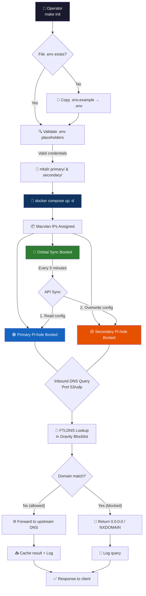
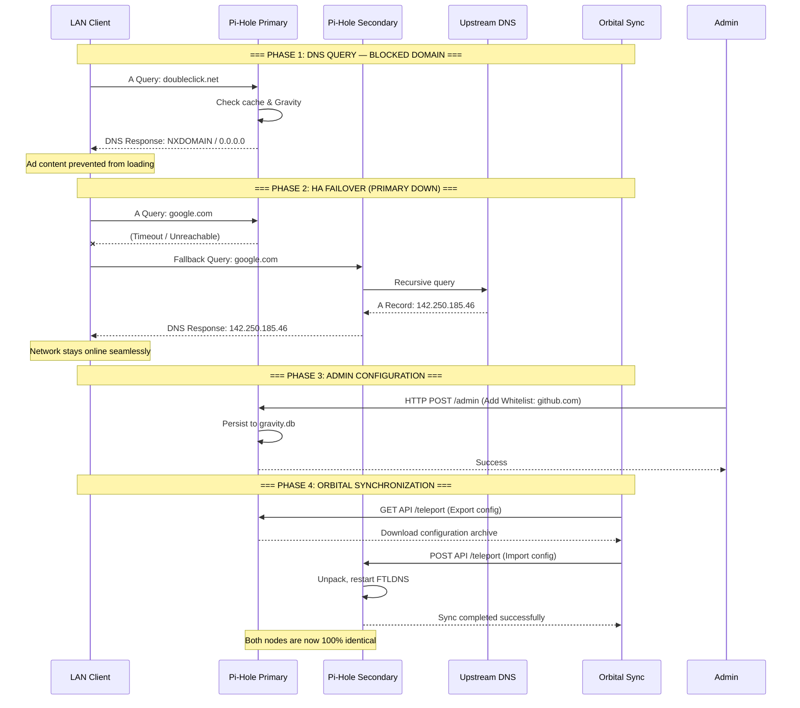
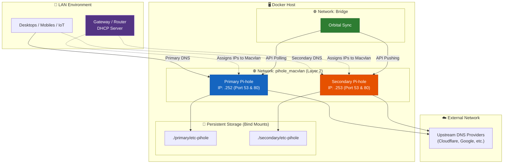

# Pi-Hole HA — Network-Wide DNS Sinkhole & High Availability Stack

Production-grade Docker deployment of **Pi-Hole** in a **High Availability (HA)** topology. This stack deploys two isolated Pi-hole instances synchronized automatically via **Orbital Sync**. It intercepts and discards queries to advertising, tracking, and malware domains at the network perimeter. Zero client-side configuration required — every device on the LAN is protected implicitly once the gateway advertises the Pi-Hole resolvers.

---

## Key Features

- **True High Availability** — Primary and Secondary DNS servers running independently on the same physical host. If one container updates or restarts, the network retains DNS resolution.
- **Macvlan Networking** — Direct Layer-2 network access for Pi-hole containers, eliminating Docker NAT overhead and port 53 mapping conflicts. Each Pi-hole gets its own physical LAN IP.
- **Automated HA Synchronization** — Orbital Sync mirrors configurations (gravity lists, local DNS, whitelists/blacklists) from Primary to Secondary automatically.
- **Network-Wide Implicit Protection** — Blocks advertisements, trackers, and telemetry domains for all connected devices without per-device agents.
- **DNS Query Caching** — Reduces upstream DNS latency and external egress by caching resolved records via FTLDNS.
- **Comprehensive Query Logging** — Persistent, searchable history of every DNS transaction with per-client breakdown in SQLite.
- **Web-Based Administration Dashboard** — Feature-rich PHP/Lighttpd interface at `/admin`. Administrators only need to log into the Primary instance; the Secondary is maintained entirely by the sync agent.
- **Makefile-Driven Automation** — Idempotent targets for initialization, Macvlan discovery (`network-check`), deployment, and log streaming.
- **Credential Isolation** — Sensitive parameters (`WEBPASSWORD_PRIMARY`, IPs, Subnets) are externalized to a git-ignored `.env` file.
- **Code Quality Assurance** — The repository enforces rigorous standards through Makefile pre-flight validation. For any Python-based extensions, Pylint > 9.5 and Bandit security linting are mandated as quality gates.

---

## Technical Stack

| Technology | Purpose | Version / Source |
|---|---|---|
| **Pi-Hole** | DNS sinkhole engine (FTLDNS + Lighttpd + PHP) | `pihole/pihole:latest` |
| **Orbital Sync** | HA Orchestrator syncing Primary to Secondary | `mattwebbio/orbital-sync:latest` |
| **FTLDNS** | Embedded DNS resolver, DHCP server, and query logging | Bundled with Pi-Hole |
| **Lighttpd + PHP** | Lightweight web server powering the admin dashboard | Bundled with Pi-Hole |
| **SQLite** | Embedded database for query history and long-term stats | Bundled with Pi-Hole |
| **Docker Engine** | Container runtime with `macvlan` driver | 24.0+ |
| **Docker Compose V2** | Declarative service orchestration | `docker compose` plugin |
| **GNU Make** | Build and lifecycle automation | 4.3+ |

---

## 🚶 Diagram Walkthrough

The following flowchart illustrates the **high-level operational flow** of the HA deployment, from initial user setup through DNS resolution and Orbital synchronization.



---

## 🗺️ System Workflow

The following sequence diagram captures the **detailed interaction timeline** during a DNS query, and the automated High Availability synchronization loop.



---

## 🏗️ Architecture Components

The static structure reveals how the **Macvlan network** solves port collisions on the host, allowing both Pi-holes to expose port 53 natively.



### Layer Responsibilities

| Layer | Responsibility |
|---|---|
| **Macvlan Network** | Bypasses Docker's standard bridge NAT. Makes the Pi-hole containers appear as physical devices on your LAN with their own MAC addresses and IPs. |
| **Core Engine (FTLDNS)** | Recursive resolution, rate limiting, query logging, and telnet/HTTP API. |
| **Persistence (Volumes)** | Separated into `./primary` and `./secondary` directories. Stores SQLite databases (Gravity, query logs). |
| **Orbital Sync** | Headless Node.js container acting as the HA orchestrator. Extracts backups from Primary and restores them on Secondary at the configured `SYNC_INTERVAL_MINUTES`. |

---

## ⚙️ Container Lifecycle

### Runtime Process

The sequence of events from `docker compose up` to a fully operational HA instance:

```
STEP 1: Compose parses the Macvlan configuration using your MACVLAN_PARENT_INTERFACE.
STEP 2: Docker requests two specific IPs from your LAN subnet (PIHOLE_PRIMARY_IP and PIHOLE_SECONDARY_IP).
STEP 3: Primary and Secondary containers boot up.
        ├── s6-overlay init executes.
        ├── WEBPASSWORD_PRIMARY and WEBPASSWORD_SECONDARY injected.
        ├── FTLDNS starts on port 53 inside both containers.
STEP 4: Orbital Sync container boots up.
        ├── Waits for both Pi-holes to report healthy via API.
        ├── Authenticates using both passwords.
        ├── Executes the first full sync from Primary -> Secondary.
STEP 5: Administrator configures router DHCP to point to both Macvlan IPs.
```

---

## 📂 File-by-File Guide

| Path | Purpose |
|---|---|
| `docker-compose.yml` | Declarative manifest defining the HA stack: Macvlan network configuration, three services (Primary, Secondary, Sync), and volume bindings. |
| `Makefile` | Automation layer (`init`, `up`, `down`, `restart`, `logs`, `logs-sync`, `network-check`). |
| `.env.example` | Template for HA secrets and network topology. Users copy to `.env` and fill in actual values. |
| `.gitignore` | Excludes `.env`, IDE artifacts, and the auto-generated `primary/` and `secondary/` data directories. |
| `primary/etc-pihole/` | Generated SQLite databases and configuration for the Master node. |
| `secondary/etc-pihole/` | Replica configuration overwritten continuously by Orbital Sync. |

---

## Installation & Setup

### Prerequisites

- Docker Engine ≥ 24.0 with Compose V2 (`docker compose` plugin)
- GNU Make ≥ 4.0
- **Two free IP addresses** on your LAN (outside the DHCP pool range)

### Deployment

```bash
# 1. Clone the repository
git clone git@github.com:Selio30/imagenesDocker.git
cd imagenesDocker/Pi-Hole

# 2. Identify your physical network interface (e.g., eth0, ens18)
make network-check

# 3. Prepare the environment
cp .env.example .env
nano .env
```

**⚠️ CRITICAL `.env` CONFIGURATION:**
You must configure the Macvlan settings to match your home network exactly:
- `MACVLAN_SUBNET`: e.g., `192.168.1.0/24`
- `MACVLAN_GATEWAY`: e.g., `192.168.1.1` (Your router's IP)
- `MACVLAN_PARENT_INTERFACE`: The name found in step 2.

```bash
# 4. Deploy the HA Stack
make init

# 5. Verify Synchronization
make logs-sync
```

### Router Configuration (Final Step)
Log into your router's DHCP settings and change the Primary and Secondary DNS servers to the `PIHOLE_PRIMARY_IP` and `PIHOLE_SECONDARY_IP` you defined in `.env`.

---

## Configuration Reference

### Environment Variables (`.env`)

| Variable | Description | Example |
|---|---|---|
| `WEBPASSWORD_PRIMARY` | Admin password for the Primary dashboard | `admin_primario_seguro` |
| `WEBPASSWORD_SECONDARY` | Admin password for Secondary (used by Sync) | `admin_secundario_seguro` |
| `MACVLAN_SUBNET` | Your LAN subnet CIDR | `192.168.1.0/24` |
| `MACVLAN_GATEWAY` | Your Router's IP address | `192.168.1.1` |
| `PIHOLE_PRIMARY_IP` | Fixed IP for the master node | `192.168.1.252` |
| `PIHOLE_SECONDARY_IP` | Fixed IP for the fallback node | `192.168.1.253` |
| `MACVLAN_PARENT_INTERFACE` | Host's physical network adapter | `eth0` / `ens18` |
| `SYNC_INTERVAL_MINUTES` | How often Orbital Sync clones the config | `5` |

---

## Usage & Maintenance

### Makefile Commands

```bash
make help          # Display available targets with descriptions
make network-check # Discover physical network interfaces
make init          # Create volumes and deploy stack
make up            # Start the services
make down          # Gracefully stop and remove the containers
make status        # Show container state and uptime
make logs          # Tail logs for all containers
make logs-sync     # Tail logs specifically for Orbital Sync
make clean         # Stop containers and remove orphaned resources
```

### Operational Rule of Thumb

> **NEVER MANUALLY EDIT THE SECONDARY PI-HOLE.** > The Secondary Pi-hole is a passive replica. Any whitelist, blacklist, or local DNS changes made via its web interface will be completely overwritten by Orbital Sync within `SYNC_INTERVAL_MINUTES`. **Always make changes on the Primary node.**

---

## Author

**Sergio Barbero — Selio30** [LinkedIn Profile](https://www.linkedin.com/in/selio30)

---

*Last Updated: 2026-05-15*
*Project Version: 2.0.0 (HA Topology)*
*License: MIT*