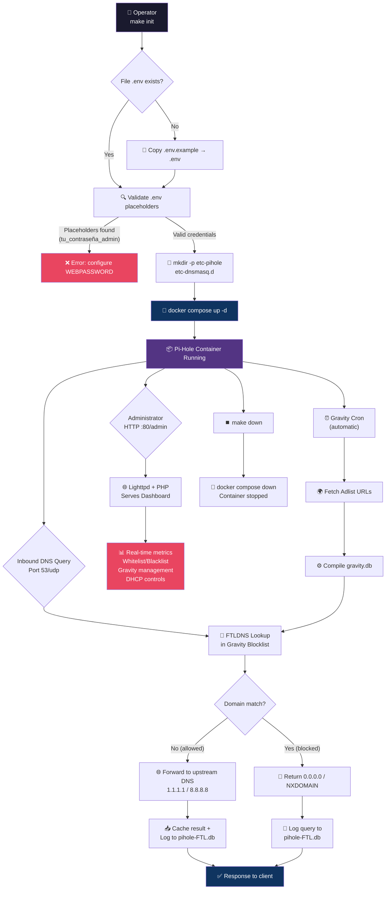
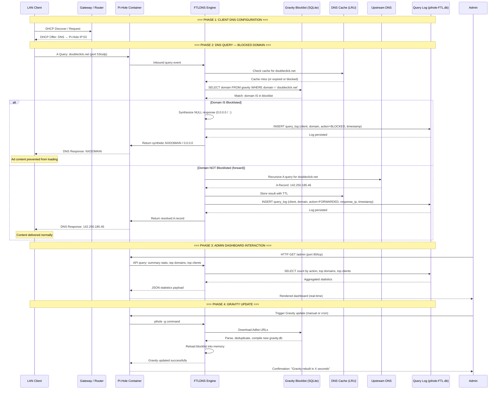

# Pi-Hole — Network-Wide DNS Sinkhole & Ad Filtering Engine

Production-grade Docker deployment of **Pi-Hole**, a kernel-efficient DNS sinkhole that intercepts and discards queries to advertising, tracking, and malware domains at the network perimeter. Zero client-side configuration required — every device on the LAN is protected implicitly once the gateway or DHCP lease advertises the Pi-Hole resolver.

---

## Key Features

- **Network-Wide Implicit Protection** — Blocks advertisements, trackers, and telemetry domains for all connected devices (desktops, mobile, IoT) without per-device agents or browser extensions.
- **DNS Query Caching** — Reduces upstream DNS latency and external egress by caching resolved records via FTLDNS, improving perceived browsing speed across the LAN.
- **Comprehensive Query Logging** — Persistent, searchable history of every DNS transaction with per-client breakdown, enabling forensic analysis and capacity planning.
- **Web-Based Administration Dashboard** — Feature-rich PHP/Lighttpd interface at `/admin` offering real-time metrics, whitelist/blacklist management, Gravity blocklist scheduling, and DHCP lease oversight.
- **Automated Gravity Synchronization** — Periodic refresh of blocklist sources (Adlists) without manual intervention; configurable cron schedule within the dashboard.
- **Optional DHCP Server** — Can function as the network's primary DHCP server, dynamically assigning leases while automatically distributing itself as the upstream DNS resolver.
- **Makefile-Driven Lifecycle Automation** — Idempotent targets for initialization, deployment, teardown, log streaming, and cleanup; validates `.env` placeholders before container start.
- **Credential Isolation by Design** — Sensitive parameters (`WEBPASSWORD`) are externalized to a git-ignored `.env` file; never hardcoded in manifests or committed to version control.
- **Code Quality Assurance** — While this is a container orchestration project (shell/Makefile/Docker), the repository enforces rigorous standards through Makefile pre-flight validation and Docker image provenance verification. For any Python-based extensions or plugins, **Pylint > 9.5** and **Bandit** security linting are mandated as quality gates.

---

## Technical Stack

| Technology | Purpose | Version / Source |
|---|---|---|
| **Pi-Hole** | DNS sinkhole engine (FTLDNS + Lighttpd + PHP) | `pihole/pihole:latest` |
| **FTLDNS** | Embedded DNS resolver, DHCP server, and query logging daemon | Bundled with Pi-Hole |
| **Lighttpd + PHP** | Lightweight web server powering the admin dashboard | Bundled with Pi-Hole |
| **SQLite** | Embedded database for query history and long-term statistics (via FTL) | Bundled with Pi-Hole |
| **Docker Engine** | Container runtime and isolation | 24.0+ |
| **Docker Compose V2** | Declarative service orchestration | `docker compose` plugin |
| **GNU Make** | Build and lifecycle automation | 4.3+ |
| **Pylint** *(quality gate)* | Static analysis for Python contributions | > 9.5 / 10 |
| **Bandit** *(quality gate)* | Security-focused AST linter for Python contributions | Latest |

---

## 🚶 Diagram Walkthrough

The following flowchart illustrates the **high-level operational flow** of the Pi-Hole deployment, from initial user setup through ongoing DNS resolution and lifecycle management.



---

## 🗺️ System Workflow

The following sequence diagram captures the **detailed interaction timeline** during the most critical operation of the system: a DNS query from a LAN client, including both the blocked and allowed paths.



---

## 🏗️ Architecture Components

The static structure of the system reveals **four logical layers** that separate concerns between the host runtime, container orchestration, the Pi-Hole engine, and the external network.

```mermaid
graph TB
    subgraph "☁️ External Network"
        UP1["Upstream DNS 1<br/>1.1.1.1 (Cloudflare)"]
        UP2["Upstream DNS 2<br/>8.8.8.8 (Google)"]
        ADLISTS_SRC["Adlist Sources<br/>(blocklist URLs)"]
    end

    subgraph "🖥️ Host Machine"
        HOST["Linux Host<br/>Docker Engine 24.0+"]
        COMPOSE["Docker Compose V2<br/>docker-compose.yml"]
        MAKE["GNU Make<br/>Makefile"]

        subgraph "📁 Host Directories (Bind Mounts)"
            VOL_ETC_PIHOLE["etc-pihole/<br/>(config, DBs)"]
            VOL_DNSMASQ["etc-dnsmasq.d/<br/>(dnsmasq overrides)"]
        end
    end

    subgraph "📦 Pi-Hole Container"
        DIRECTION TB

        subgraph "🌐 Network Interface Layer"
            P53["Port 53/udp+tcp<br/>DNS Listener (FTL)"]
            P80["Port 80/tcp<br/>HTTP Server (Lighttpd)"]
        end

        subgraph "🧠 Core Engine Layer"
            FTL["FTLDNS<br/>- Recursive resolver<br/>- DHCP server<br/>- Query logging<br/>- Rate limiting<br/>- API endpoint"]
            GRAVITY["Gravity Engine<br/>- Adlist downloader<br/>- Domain compiler<br/>- Blocklist manager"]
            CACHE["DNS Cache<br/>In-Memory LRU<br/>TTL-aware"]
        end

        subgraph "🗄️ Persistence Layer"
            DB[(SQLite<br/>pihole-FTL.db)]
            CONF["setupVars.conf<br/>Web UI state"]
            ADLISTS_FILE["adlists.list<br/>Active sources"]
        end

        subgraph "🌍 Web Interface Layer"
            LW["Lighttpd<br/>Web Server"]
            PHP["PHP Engine<br/>Application logic"]
            DASH["Admin Dashboard<br/>/admin"]
        end

        P53 --> FTL
        FTL --> CACHE
        FTL --> GRAVITY
        FTL --> DB
        FTL --> CONF
        GRAVITY --> DB
        GRAVITY --> ADLISTS_FILE
        P80 --> LW
        LW --> PHP
        PHP --> DASH
        DASH -- "API calls" --> FTL
    end

    subgraph "👥 LAN Clients"
        CLIENTS["Desktops / Mobiles / IoT<br/>Automatic DNS via DHCP"]
    end

    CLIENTS --> P53
    FTL --> VOL_ETC_PIHOLE
    FTL --> VOL_DNSMASQ
    FTL --> UP1
    FTL --> UP2
    GRAVITY --> ADLISTS_SRC
    MAKE --> COMPOSE
    COMPOSE --> HOST

    style HOST fill:#1a1a2e,color:#fff,stroke:#16213e
    style FTL fill:#0f3460,color:#fff,stroke:#e94560
    style DB fill:#533483,color:#fff,stroke:#16213e
    style DASH fill:#e94560,color:#fff,stroke:#16213e
    style CLIENTS fill:#1a1a2e,color:#fff,stroke:#16213e
    style UP1 fill:#0f3460,color:#fff,stroke:#16213e
    style UP2 fill:#0f3460,color:#fff,stroke:#16213e
```

### Layer Responsibilities

| Layer | Responsibility |
|---|---|
| **Network Interface** | Listens on port 53/udp+tcp for inbound DNS queries from LAN clients; serves the web-based admin dashboard on port 80/tcp. |
| **Core Engine** | FTLDNS daemon performing recursive resolution, DHCP lease management, rate limiting, query logging, and telnet/HTTP API. Gravity compiles blocklists from remote sources. LRU cache accelerates repeat queries. |
| **Persistence** | SQLite-backed storage for the gravity blocklist, query history, long-term statistics, and DHCP leases. Configuration persists across container recreations via bind mounts. |
| **Web Interface** | Lighttpd + PHP stack providing the feature-rich admin console: real-time graphs, per-client breakdowns, whitelist/blacklist controls, and Gravity update triggers. |
| **Host Bind Mounts** | Host directories (`etc-pihole/`, `etc-dnsmasq.d/`) mapped into the container ensure all state survives container updates, restarts, and migrations. |
| **Deployment Automation** | GNU Make targets wrap Docker Compose commands with pre-flight validation, directory initialization, and credential checks. |

---

## ⚙️ Container Lifecycle

### a. Build Process

This project uses the **official upstream image** (`pihole/pihole:latest`) — no custom `Dockerfile` is maintained. The upstream image is built on **Debian** (slim variant) and assembles the following components:

```
STEP 1: Base Image
        └── debian:stable-slim (~80 MB)
STEP 2: System Dependencies
        ├── lighttpd          (web server)
        ├── php-cgi           (PHP runtime for dashboard)
        ├── curl, wget        (Adlist download, Gravity)
        ├── sqlite3           (embedded database engine)
        ├── dnsmasq           (DNS forwarder, replaced by FTL)
        └── ca-certificates   (TLS for Adlist fetches)
STEP 3: FTLDNS Binary
        ├── pihole-FTL        (pre-compiled Go/C daemon)
        └── pihole            (shell-based administration CLI)
STEP 4: Web Interface Assets
        ├── /var/www/html/admin/  (PHP dashboard source)
        ├── JavaScript/Chart.js   (real-time graphs)
        └── CSS/theme assets
STEP 5: Entrypoint Script
        └── /init.sh or s6-overlay
            ├── Generate random password (if WEBPASSWORD unset)
            ├── Apply environment configuration
            ├── Initialize pihole-FTL.db (SQLite schema)
            ├── Start lighttpd + PHP CGI
            ├── Start FTLDNS daemon
            └── Schedule Gravity cron (daily)
STEP 6: Healthcheck
        └── dig @127.0.0.1 +short google.com || exit 1
```

> **Note:** The `:latest` tag is intentionally tracked to receive automatic security patches and feature updates. For production environments that require pinned versions, replace with a specific release tag (e.g., `pihole/pihole:2025.03.0`).

### b. Runtime Process

The sequence of events from `docker compose up` to a fully operational Pi-Hole instance:

```
STEP 1: Docker Engine resolves pihole/pihole:latest (pulls if not cached)
STEP 2: Compose creates the default bridge network (pihole_default)
STEP 3: Bind mounts are validated:
        ├── ./etc-pihole      → /etc/pihole        (core state)
        └── ./etc-dnsmasq.d   → /etc/dnsmasq.d     (resolver overrides)
STEP 4: Container starts → s6-overlay init executes
STEP 5: Pi-Hole bootstrap sequence:
        ├── 5a. /etc/pihole/ directory check (creates if missing)
        ├── 5b. Environment variable injection:
        │       ├── WEBPASSWORD → setupVars.conf
        │       ├── TZ          → /etc/timezone + php timezone
        │       ├── PIHOLE_DNS_1/2 → /etc/dnsmasq.d/01-pihole.conf
        │       └── DHCP_*      → /etc/dnsmasq.d/02-dhcp.conf
        ├── 5c. pihole-FTL.db initialization:
        │       ├── CREATE TABLE queries, clients, ftl, etc.
        │       └── CREATE INDEX on timestamp, domain, client
        ├── 5d. Gravity compilation (first run — may take 30-60s):
        │       ├── Download default Adlists
        │       ├── Parse, deduplicate, compile gravity.db
        │       └── Signal FTL to reload blocklist
        ├── 5e. Lighttpd startup:
        │       ├── Bind to 0.0.0.0:80
        │       ├── Enable php-cgi handler
        │       └── Serve /admin virtual host
        ├── 5f. FTLDNS daemon startup:
        │       ├── Bind to 0.0.0.0:53 (udp + tcp)
        │       ├── Load gravity blocklist into memory
        │       ├── Open pihole-FTL.db for writing
        │       └── Start telnet API listener (port 4711, loopback)
        └── 5g. Cron scheduler activation:
                └── Schedule pihole updateGravity (daily at 04:00)
STEP 6: Healthcheck passes (dig @127.0.0.1 google.com)
STEP 7: Container marked as "healthy" by Docker
STEP 8: Web UI available at http://<host-ip>:80/admin
```

---

## 📂 File-by-File Guide

| Path | Purpose |
|---|---|
| `docker-compose.yml` | Declarative Compose manifest defining the Pi-Hole service: upstream image tag, port mappings (53/udp+tcp, 80/tcp), bind mount volumes for persistent state, `NET_ADMIN` capability for FTL, and `unless-stopped` restart policy. |
| `Makefile` | Automation layer with idempotent targets (`help`, `check-env`, `init`, `up`, `down`, `restart`, `status`, `logs`, `clean`) for lifecycle management without remembering Compose commands. |
| `.env.example` | Template for environment secrets (`WEBPASSWORD`, `TZ`, `PIHOLE_DNS_*`). Git-tracked; users copy to `.env` and fill in actual values. |
| `.env` | Active environment variables file. **Git-ignored** — never committed to version control. Injected into the container via `env_file` directive. |
| `.gitignore` | Excludes `.env`, volume data directories (`etc-pihole/`, `etc-dnsmasq.d/`), IDE artifacts (`.vscode/`, `.idea/`), and temporary files (`.DS_Store`, `*.swp`, `*.log`) from version control. |
| `README.md` | Project documentation — this file. |
| `etc-pihole/pihole-FTL.db` | SQLite database created at runtime by FTLDNS. Stores query history, client statistics, long-term analytics, and DHCP lease data. |
| `etc-pihole/gravity.db` | Compiled blocklist database generated by Gravity. Contains all blocked domains from configured Adlists, optimized for fast lookup. |
| `etc-pihole/adlists.list` | Plain-text file listing active Adlist URLs used by Gravity to fetch and compile blocklists. |
| `etc-pihole/setupVars.conf` | Key-value configuration file written by the web UI and the entrypoint script. Mirrors environment variables and dashboard settings. |
| `etc-dnsmasq.d/01-custom.conf` | User-defined dnsmasq configuration overrides. Supports conditional forwarding, custom CNAME entries, and per-domain upstream DNS routing. |

---

## Installation & Setup

### Prerequisites

- Docker Engine ≥ 24.0 with Compose V2 (`docker compose` plugin)
- GNU Make ≥ 4.0
- Host ports `53/udp`, `53/tcp`, and `80/tcp` available and unbound
- A registered domain (optional, for custom `hostname` / `domainname` resolution)

### Deployment

```bash
# Clone the monorepo and enter the Pi-Hole stack directory
git clone git@github.com:Selio30/imagenesDocker.git
cd imagenesDocker/Pi-Hole

# One-command initialization: copies .env.example → .env,
# creates persistent volume directories, validates config, and deploys
make init

# After first access, set your admin password via the web UI
# or by editing .env and running:
make up
```

### Manual (Step-by-Step)

```bash
# 1. Bootstrap environment configuration
cp .env.example .env
nano .env                         # Set WEBPASSWORD, TZ, PIHOLE_DNS_*

# 2. Create persistent data directories
mkdir -p etc-pihole etc-dnsmasq.d

# 3. Deploy the container
docker compose -f docker-compose.yml -p pihole up -d

# 4. Verify operational state
docker compose -p pihole ps
```

The admin console is available at **`http://<host-ip>:80/admin`**.

---

## Configuration

### Environment Variables (`.env`)

| Variable | Description | Example | Required |
|---|---|---|---|
| `WEBPASSWORD` | Administrative password for the web dashboard | `MySecurePass123` | Yes |
| `TZ` | Timezone for log timestamps and scheduled Gravity updates | `Europe/Madrid` | Yes |
| `PIHOLE_DNS_1` | Primary upstream DNS resolver | `1.1.1.1` | Yes |
| `PIHOLE_DNS_2` | Secondary upstream DNS resolver | `8.8.8.8` | Yes |

> **Security**: The `.env` file is permanently excluded from version control via `.gitignore`. Never hardcode credentials in `docker-compose.yml` or commit `.env` to the repository.

### Additional Pi-Hole Runtime Configuration

Once the container is running, the following advanced settings can be modified through the admin dashboard (`Settings > DNS`) or directly via environment variables in `.env`:

| Variable | Purpose | Default |
|---|---|---|
| `PIHOLE_DNS_3` | Tertiary upstream DNS resolver | *(none)* |
| `DHCP_ACTIVE` | Enable Pi-Hole DHCP server (`true`/`false`) | `false` |
| `DHCP_START` | DHCP lease pool start | `192.168.0.2` |
| `DHCP_END` | DHCP lease pool end | `192.168.0.254` |
| `DHCP_ROUTER` | Default gateway advertised via DHCP | `192.168.0.1` |
| `DHCP_LEASETIME` | DHCP lease duration in hours | `24` |
| `WEBTHEME` | Dashboard theme (`default-light`/`default-dark`/`default-darker`) | `default-light` |

### Docker Compose Reference

The `docker-compose.yml` manifest (`Pi-Hole/docker-compose.yml:1-18`) defines:

- **Image**: `pihole/pihole:latest` — official upstream image with automatic security patches.
- **Capabilities**: `NET_ADMIN` — required for FTLDNS to manipulate firewall rules and manage raw sockets.
- **Ports**: `53/udp+tcp` (DNS), `80/tcp` (admin dashboard).
- **Volumes**: `./etc-pihole:/etc/pihole` (Pi-Hole state, gravity DB, config), `./etc-dnsmasq.d:/etc/dnsmasq.d` (dnsmasq overrides).
- **Restart Policy**: `unless-stopped` — automatic recovery after host reboot or Docker daemon restart.

---

## Usage

### Makefile Commands

```bash
make help      # Display available targets with descriptions
make init      # One-shot: copy .env.example → .env, create volumes, validate, deploy
make up        # Start the service (requires configured .env)
make down      # Gracefully stop and remove the container
make restart   # Restart the running container
make status    # Show container state, port mappings, and uptime
make logs      # Tail real-time logs (last 50 lines)
make clean     # Stop container and remove orphaned resources
```

### Manual Docker Commands

```bash
# Start the container
docker compose -f docker-compose.yml -p pihole up -d

# Stream logs in real time
docker compose -p pihole logs -f --tail=50

# Inspect container metadata
docker compose -p pihole ps

# Execute a Pi-Hole binary inside the container
docker compose -p pihole exec pihole pihole -g     # Manually update Gravity

# Query blocklist status
docker compose -p pihole exec pihole pihole -q -ad domain.com
```

### First-Time Setup

1. Open `http://<host-ip>:80/admin` in a browser.
2. Log in using the password specified in `WEBPASSWORD`.
3. Navigate to **Settings > DNS** to configure upstream DNS providers.
4. Navigate to **Group Management > Adlists** to add additional blocklist sources.
5. Run `pihole -g` (or wait for the automatic Gravity update cron) to compile new blocklists.

---

## Author

**Sergio Barbero — Selio30**  
[LinkedIn Profile](https://www.linkedin.com/in/selio30)

---

*Last Updated: 2026-05-15*  
*Project Version: 1.0.0*  
*License: MIT*
