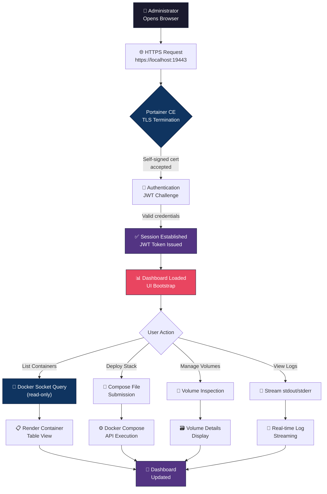
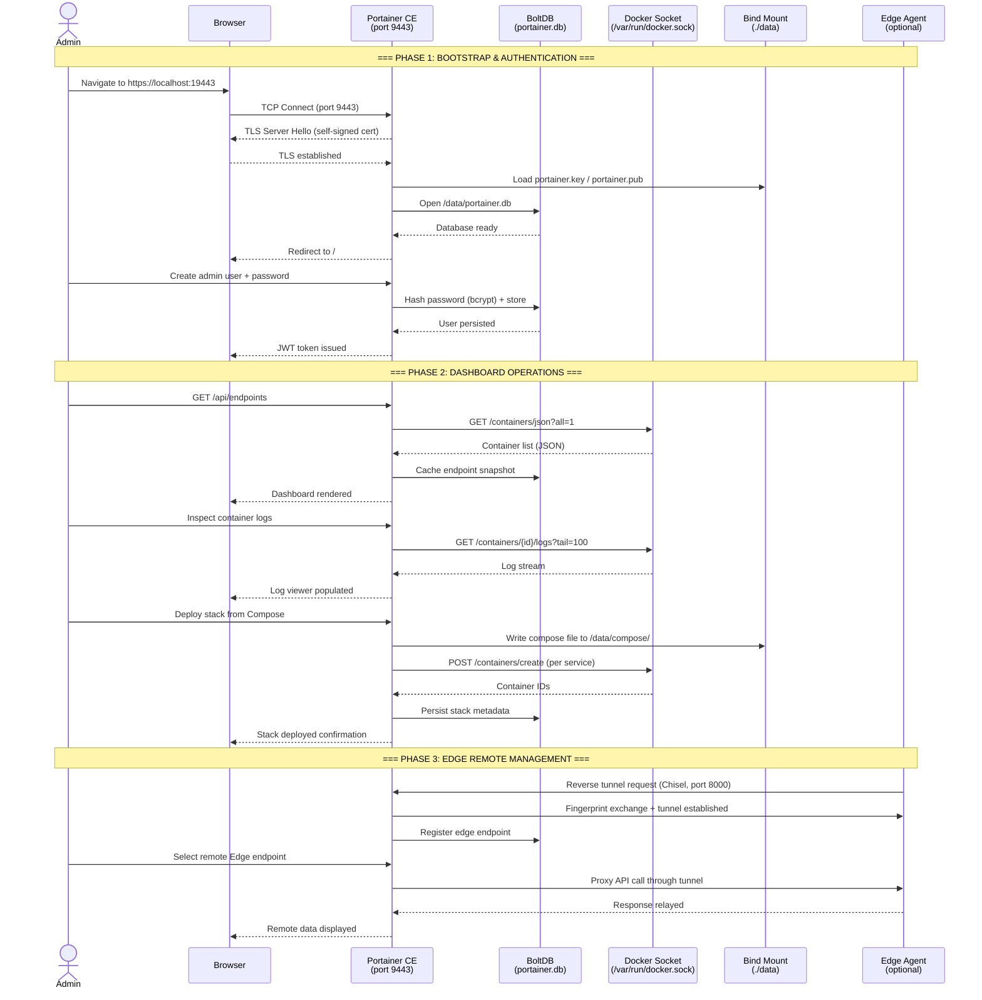
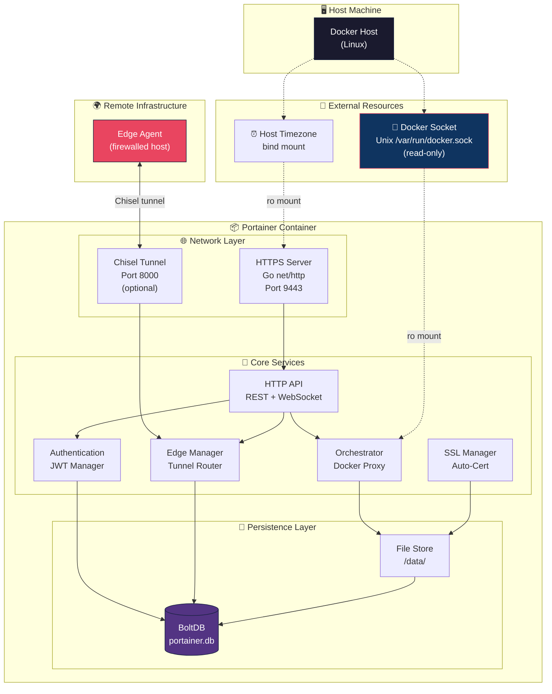

# Portainer CE — Centralized Container Orchestration Dashboard

Production-ready deployment of **Portainer Community Edition** that provides a unified, web-based interface for managing Docker hosts, containers, images, networks, and volumes across standalone and swarm environments. This stack is designed for instant bootstrapping with zero configuration overhead, hardened defaults, and persistent data isolation.

---

## Key Features

- **Visual Container Management** — Full lifecycle control (start, stop, restart, remove, inspect) without CLI dependence.
- **Read-Only Docker Socket** — Mounted as `ro` to minimize attack surface; Portainer audits without mutating the daemon directly.
- **Automatic SSL Termination** — Self-signed certificate generation on first boot; HTTPS exposed on a non-standard port to bypass common scanning patterns.
- **No-New-Privileges Hardening** — Container runs with `security_opt: no-new-privileges:true`, preventing privilege escalation via kernel vulnerabilities.
- **Atomic Lifecycle Automation** — Full `Makefile` with idempotent targets for init, up, down, restart, logs, status, and clean operations.
- **Persistent State** — BoltDB-backed database (`portainer.db`) and Chisel encryption keys survive container recreations via bind-mounted volume.
- **Edge Agent Ready** — Chisel reverse tunnelling enabled by default; uncomment port `8000` to register remote Edge endpoints.

---

## Technical Stack

| Component | Technology |
|---|---|
| **Orchestration Platform** | Portainer CE 2.39.0 (`portainer/portainer-ce:latest`) |
| **Container Runtime** | Docker 29.4.x + Compose V2 |
| **Database Engine** | BoltDB (embedded, file-based) |
| **Reverse Tunnel** | Chisel (embedded in Portainer) |
| **Web Server** | Go net/http with TLS 1.3 |
| **Automation** | GNU Make 4.x |
| **Base Image** | Alpine Linux (upstream) |

---

## 🚶 Diagram Walkthrough

High-level request flow from the moment an administrator opens the browser to the moment the dashboard renders operational data.



---

## 🗺️ System Workflow

Detailed sequence of events during a critical container management operation, from authentication through remote Edge tunnelling.



---

## 🏗️ Architecture Components

Static structure of the deployment showing layer separation, data stores, and external dependencies.



### Layer Responsibilities

| Layer | Role |
|---|---|
| **Network Layer** | Terminates TLS, manages HTTP/2 multiplexing, handles WebSocket upgrades for log streaming and terminal sessions. |
| **Core Services** | Route API requests, enforce authentication, proxy Docker API calls, orchestrate Edge tunnel routing, manage SSL certificate lifecycle. |
| **Persistence Layer** | Stores users, endpoint metadata, stack configurations, and cryptographic material. BoltDB provides ACID compliance without external dependencies. |
| **External Resources** | Read-only Docker socket for daemon communication; host timezone bind mount for accurate log timestamps. |

---

## ⚙️ Container Lifecycle

### a. Build Process

Portainer CE is an **upstream-distributed image** (`portainer/portainer-ce:latest`) — no custom `Dockerfile` is maintained in this project. The image build chain is:

1. **Alpine Base** — Upstream starts from `alpine:latest` (~5 MB).
2. **Portainer Binaries** — Pre-compiled Go backend (`/portainer`) and Node.js frontend assets are copied into the image.
3. **Healthcheck** — An embedded healthcheck pings the HTTP API at `/` every 30s.
4. **User Context** — Container runs as non-root `root` (Alpine default UID 0 with `no-new-privileges` constraint).
5. **Entrypoint** — `/portainer` binary with HCL configuration and auto-detection of mount paths.

> This deployment pulls the immutable upstream image. No custom image registry or multi-stage build is involved.

### b. Runtime Process

Sequence of events from `docker compose up` to a fully operational Portainer instance:

```
STEP 1: Docker Engine pulls portainer/portainer-ce:latest (if not cached)
STEP 2: Compose creates the Docker bridge network (portainer_default)
STEP 3: Bind mounts are validated:
        ├── /etc/localtime → /etc/localtime:ro  (timezone sync)
        ├── /var/run/docker.sock → /var/run/docker.sock:ro (Docker access)
        └── ./data → /data  (persistence)
STEP 4: Container starts → /portainer entrypoint executes
STEP 5: Portainer bootstrap sequence:
        ├── 5a. Generate JWT signing key pair → /data/portainer.key/.pub
        ├── 5b. Create / open BoltDB database → /data/portainer.db
        ├── 5c. Generate self-signed TLS certificate → /data/certs/
        ├── 5d. Initialize Chisel tunnel identity → /data/chisel/private-key.pem
        ├── 5e. Start internal HTTP server (port 9000, health endpoint)
        ├── 5f. Start HTTPS server (port 9443, web UI + API)
        └── 5g. Start Chisel tunnel listener (port 8000, if configured)
STEP 6: Healthcheck passes → Docker marks container as "healthy"
STEP 7: Web UI available at https://host:19443
```

---

## 📂 File-by-File Guide

| Path | Purpose |
|---|---|
| `docker-compose.yml` | Single-service Compose manifest defining the Portainer CE container: image tag, restart policy, security constraints, bind mounts (Docker socket, timezone, data), and port publishing rules. |
| `Makefile` | Automation layer with idempotent targets (`init`, `up`, `down`, `restart`, `status`, `logs`, `clean`) for lifecycle management without remembering Compose commands. |
| `README.md` | This document — entry point for developers, operators, and security auditors. |
| `data/portainer.db` | BoltDB embedded database storing all Portainer state: users (bcrypt-hashed passwords), endpoints, registries, stacks, settings, and activity logs. |
| `data/portainer.key` | RSA private key used to sign JWT session tokens. Auto-generated on first boot. **Must be backed up** — loss invalidates all active sessions. |
| `data/portainer.pub` | RSA public key for JWT token verification. Corresponds to `portainer.key`. |
| `data/certs/` | Directory containing auto-generated self-signed TLS certificate and key for HTTPS termination. |
| `data/chisel/private-key.pem` | ECDSA private key for Chisel reverse tunnel identity. Enables mutual authentication with Edge agents. |
| `data/compose/` | Stores uploaded Docker Compose stack definitions (one subdirectory per stack). |
| `data/docker_config/` | Cached Docker configuration resources (secrets, configs) referenced by deployed stacks. |
| `data/tls/` | User-uploaded TLS certificates for custom domain or CA-signed HTTPS configurations. |
| `data/bin/` | Portainer binary cache for edge-agent binaries and auxiliary tools. |

---

## Installation & Setup

### Prerequisites

- Docker Engine ≥ 24.0
- Docker Compose V2 (`docker compose` plugin)
- GNU Make
- Port `19443` available on the host

### Quick Start

```bash
# Clone the repository
git clone git@github.com:Selio30/imagenesDocker.git
cd imagenesDocker/Portainer

# Deploy the stack (creates data/ directory, pulls image, starts container)
make init

# Verify running state
make status
```

### Manual Steps

```bash
# Create persistent data directory
mkdir -p data

# Start Portainer
docker compose -f docker-compose.yml -p portainer up -d
```

The web UI is immediately available at **`https://localhost:19443`**. On first access, Portainer prompts for an administrator password.

---

## Configuration

### Environment & Ports

This deployment uses **no `.env` file** — all configuration is self-contained in `docker-compose.yml`. Customize the following before production use:

| Parameter | File Location | Default | Description |
|---|---|---|---|
| `PORTAINER_HTTPS_PORT` | `docker-compose.yml:13` | `19443:9443` | Host port for HTTPS web UI |
| `PORTAINER_EDGE_PORT` | `docker-compose.yml:14` | `8000` (commented) | Host port for Edge reverse tunnelling |
| `TZ` | `docker-compose.yml:9` | Host `/etc/localtime` | Timezone synchronization via bind mount |
| `PORTAINER_DATA` | `docker-compose.yml:11` | `./data:/data` | Persistent data directory |

> **Security Note:** For VPS or public deployments, bind the HTTPS port to `127.0.0.1:19443` and place a reverse proxy (Caddy, Nginx, Traefik) with Let's Encrypt in front. Do not expose the raw self-signed certificate to the internet.

### Makefile Reference

```bash
make help      # Display available commands
make init      # Create data/ and deploy stack
make up        # Start Portainer
make down      # Stop and remove container
make restart   # Restart Portainer
make status    # Show container state and port mappings
make logs      # Tail real-time logs (last 50 lines)
make clean     # Remove container + orphans (preserves data/)
```

---

## Usage Examples

```bash
# Monitor real-time logs after deployment
make logs

# Quick health check — confirm HTTPS endpoint is responsive
curl -k -o /dev/null -s -w "%{http_code}" https://localhost:19443
# Expected: 200 (redirects to /#!/init/admin)

# Inspect the auto-generated database
sudo file data/portainer.db
# Expected: "data/portainer.db: ...BoltDB..."

# Check generated TLS certificates
docker compose -p portainer exec portainer \
  ls -la /data/certs/ 2>/dev/null || echo "cert directory inside container"
```

---

## Author

**Sergio Barbero** — [Selio30](https://www.linkedin.com/in/Selio30)
