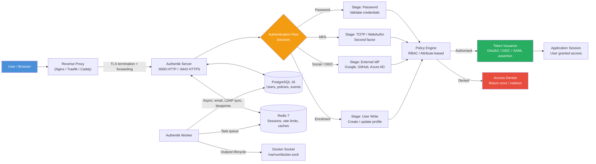
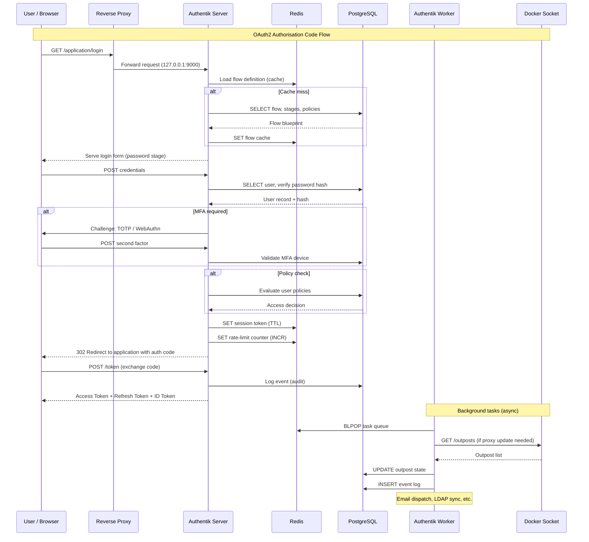
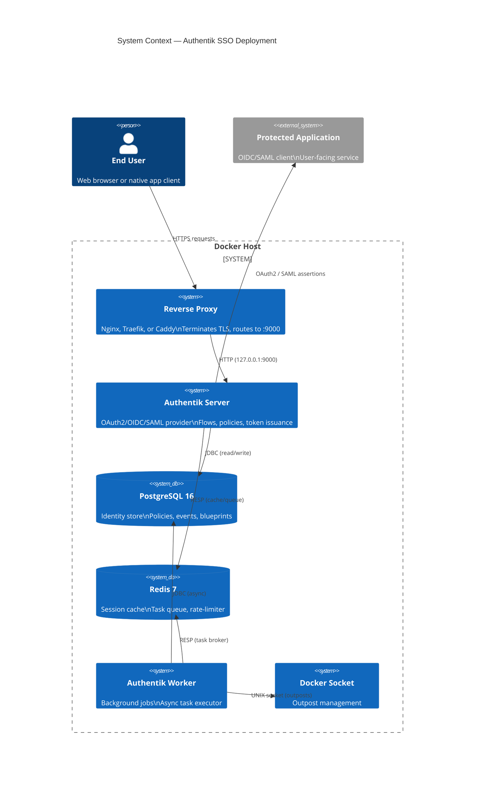
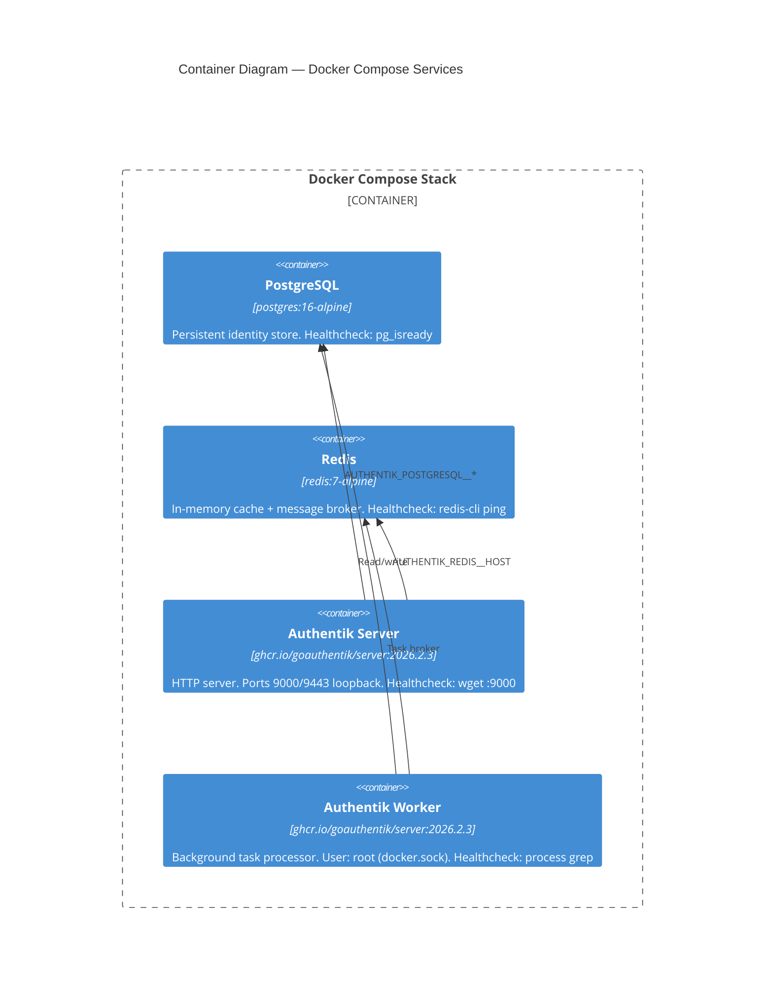
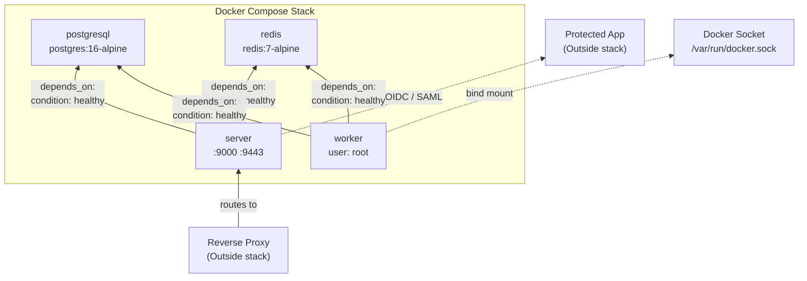

# Authentik SSO & Identity Provider

**Production-grade, containerised Authentik deployment** — a self-hosted identity provider delivering single sign-on (SSO), multi-factor authentication (MFA), and centralised identity brokering for modern application ecosystems. This stack is designed for security, observability, and operational simplicity out of the box.

---

## Key Features

- **Zero-trust SSO** — Centralised authentication across any application with OAuth2/OIDC, SAML, and LDAP protocols.
- **Hardened by default** — All services bind to loopback (`127.0.0.1`); exposure requires an explicit reverse proxy.
- **Health-aware orchestration** — Every container carries a custom healthcheck; PostgreSQL and Redis dependencies gate the server and worker startup.
- **Cryptographic secret bootstrapping** — One-command generation of `AUTHENTIK_SECRET_KEY` and `PG_PASS` via `openssl rand`.
- **Privacy-first** — Telemetry and update checks disabled by default.
- **Immutable tag pinning** — Authentik version pinned to a specific release to prevent accidental drift.
- **Persistent storage** — Database, media, certificates, and templates survive container restarts and upgrades.
- **Docker outpost auto-discovery** — The worker mounts the Docker socket for automatic outpost lifecycle management.

---

## Technical Stack

| Component | Technology | Version |
|---|---|---|
| Identity Provider | [goauthentik/server](https://github.com/goauthentik/authentik) | `2026.2.3` |
| Database | PostgreSQL (Alpine) | `16` |
| Cache / Broker | Redis (Alpine) | `7` |
| Container Runtime | Docker Compose | v2 |
| Automation | GNU Make | — |

---

## 🚶 Diagram Walkthrough



### Flow Summary

1. **Ingress** — All traffic arrives at a reverse proxy that terminates TLS and forwards plain HTTP to Authentik on `127.0.0.1:9000`.
2. **Flow orchestration** — Authentik evaluates the incoming request against a configured **flow** (login, enrolment, recovery, etc.). Each flow is an ordered chain of stages.
3. **Stage execution** — Stages collect credentials (password, TOTP code, WebAuthn challenge) or delegate to external identity providers via OIDC/SAML.
4. **Policy evaluation** — After credential validation, the **policy engine** evaluates RBAC and attribute-based rules to determine authorisation.
5. **Token issuance** — If authorised, Authentik issues an OAuth2 access/refresh token, an OIDC ID token, or a SAML assertion. The user is redirected to the application.
6. **Background processing** — The worker asynchronously handles email dispatch, LDAP synchronisation, blueprint application, and outpost proxy management via the Docker socket.

---

## 🗺️ System Workflow



### Critical Path — Authentication Sequence

1. The user requests a protected resource; the reverse proxy forwards to the Authentik server.
2. The server loads the flow blueprint from Redis cache or PostgreSQL.
3. The user completes one or more stages (password → optional MFA).
4. The policy engine evaluates rules against the authenticated user and requested scope.
5. On success, tokens are issued and a session is stored in Redis.
6. Every authentication event is persisted to PostgreSQL for audit logging.
7. The worker continuously consumes tasks from Redis — managing outposts, sending emails, syncing directories.

---

## 🏗️ Architecture Components





### Dependency Graph



---

## ⚙️ Container Lifecycle

### a. Build Process

Since this project consumes **pre-built images** from registries, no local `Dockerfile` is required. The "build" corresponds to image resolution and layer caching:

```
1. docker compose pull
   ├── Pull ghcr.io/goauthentik/server:2026.2.3
   │   ├── Base OS layer (Alpine Linux)
   │   ├── Python runtime layer (3.12)
   │   ├── Django + Celery + dependencies layer
   │   └── Authentik application layer
   ├── Pull postgres:16-alpine
   │   ├── Alpine base layer
   │   └── PostgreSQL engine + extensions layer
   └── Pull redis:7-alpine
       ├── Alpine base layer
       └── Redis server + modules layer

2. docker compose up -d
   ├── Create default bridge network (authentik_default)
   ├── Create named volumes from bind mounts
   └── Start containers in dependency order
```

> **Note:** Tag `2026.2.3` is immutable. The `AUTHENTIK_TAG` variable can be changed in `.env` to upgrade or downgrade. Always review [release notes](https://docs.goauthentik.io/docs/releases/) before bumping.

### b. Runtime Process

```
┌────────────────────────────────────────────────┐
│  Container Startup Sequence                     │
├────────────────────────────────────────────────┤
│                                                  │
│  1. Docker Engine creates                        │
│     └── Network namespace                        │
│     └── Mount volumes (media, certs, templates)  │
│     └── Set environment variables                │
│                                                  │
│  2. PostgreSQL (PID 1)                           │
│     ├── pg_isready? ← loop until healthy         │
│     └── Accept connections on :5432              │
│                                                  │
│  3. Redis (PID 1)                                │
│     ├── redis-cli ping? ← loop until PONG        │
│     └── Accept connections on :6379              │
│                                                  │
│  4. Authentik Server (PID 1)                     │
│     ├── Read .env / environment variables        │
│     ├── Wait for PostgreSQL (django checks)      │
│     ├── Wait for Redis                           │
│     ├── Run database migrations (if needed)      │
│     ├── Apply blueprints (default flows, stages) │
│     └── Start gunicorn on :9000 (HTTP)           │
│     └── wget :9000/ ← healthcheck (60s delay)    │
│                                                  │
│  5. Authentik Worker (PID 1)                     │
│     ├── Connect to Redis (task broker)           │
│     ├── Connect to PostgreSQL (data access)      │
│     ├── Mount Docker socket for outposts         │
│     └── Start Celery worker (task consumer)      │
│     └── ps | grep worker ← healthcheck (30s)     │
│                                                  │
│  6. All healthy → Stack ready for traffic        │
│                                                  │
└────────────────────────────────────────────────┘
```

#### Healthcheck Ladder

Each service will be restarted by Docker if its healthcheck fails repeatedly:

| Service | Check Method | Start Period | Interval | Retries |
|---|---|---|---|---|
| PostgreSQL | `pg_isready -d $POSTGRES_DB -U $POSTGRES_USER` | 20s | 30s | 5 |
| Redis | `redis-cli ping | grep PONG` | 20s | 30s | 5 |
| Authentik Server | `wget -q -O /dev/null http://127.0.0.1:9000/` | 60s | 30s | 5 |
| Authentik Worker | `ps aux | grep -q 'authentik.*worker'` | 30s | 30s | 5 |

---

## 📂 File-by-File Guide

| File / Directory | Purpose |
|---|---|
| `docker-compose.yml` | **Service orchestration** — defines 4 containers (postgresql, redis, server, worker), their healthchecks, volumes, environment, port bindings, and dependency ordering |
| `Makefile` | **Automation layer** — wraps `docker compose` with targets: `init`, `up`, `down`, `logs`, `status`, `generate-secret`, `check-env`, `clean` |
| `.env.example` | **Configuration template** — documents every environment variable with placeholders; checked into version control as a reference |
| `.env` | **Actual secrets and config** — generated from `.env.example` via `make generate-secret`; excluded from git by `.gitignore` |
| `.gitignore` | **Version control exclusions** — ignores `.env`, `data/` (persistent volumes), `*.log`, `.DS_Store` |
| `data/database/` | **PostgreSQL data directory** — created at runtime; contains all identity records, policies, event logs, and blueprints |
| `data/redis/` | **Redis append-only file (AOF)** — created at runtime; persists session and task data across restarts |
| `data/media/` | **Uploaded media** — user avatars, branding assets, file uploads from flows |
| `data/certs/` | **Custom TLS certificates** — mounted into the worker for outpost communication |
| `data/custom-templates/` | **Custom email/branding templates** — mounted into both server and worker for flow stage rendering and email dispatch |

---

## Installation & Setup

### Prerequisites

- Docker Engine **>= 24.0**
- Docker Compose **>= 2.20**
- GNU Make
- `openssl` (for secret generation)

### Quick Start

```bash
# 1. Clone the repository
git clone git@github.com:Selio30/imagenesDocker.git
cd imagenesDocker/Redes_y_Seguridad/Authentik

# 2. Generate cryptographic secrets and create .env
make generate-secret

# 3. Launch the full stack
make init

# 4. Verify service health
make status
```

The initial admin credentials are displayed in the server logs after the first startup:

```bash
make logs
# Look for: "admin: authentik / <auto-generated-password>"
```

---

## Configuration

### Environment Variables

| Variable | Required | Default | Description |
|---|---|---|---|
| `AUTHENTIK_TAG` | No | `2026.2.3` | Pin Authentik image version |
| `AUTHENTIK_SECRET_KEY` | **Yes** | — | Cryptographic signing key (32+ chars, base64) |
| `AUTHENTIK_ERROR_REPORTING__ENABLED` | No | `false` | Disable Sentry telemetry |
| `AUTHENTIK_DISABLE_UPDATE_CHECK` | No | `true` | Disable update availability checks |
| `PG_USER` | No | `authentik` | PostgreSQL user name |
| `PG_DB` | No | `authentik` | PostgreSQL database name |
| `PG_PASS` | **Yes** | — | PostgreSQL password |

> The `AUTHENTIK_SECRET_KEY` and `PG_PASS` variables contain **placeholders** in `.env.example`. Run `make generate-secret` to replace them with cryptographically secure values.

### `.env` file

The `.env` file is loaded by Docker Compose and is **excluded from version control** via `.gitignore`. Create it from the template:

```bash
cp .env.example .env
# OR (recommended):
make generate-secret
```

---

## Usage

### Makefile Commands

| Command | Description |
|---|---|
| `make help` | Display available targets |
| `make check-env` | Validate that `.env` exists and contains no default placeholders |
| `make generate-secret` | Generate cryptographically secure secrets and inject them into `.env` |
| `make init` | Initialise the full stack (`check-env` → `docker compose up -d`) |
| `make up` | Start all services (alias for `docker compose up -d`) |
| `make down` | Stop all services |
| `make restart` | Restart all services |
| `make status` | Show container health status |
| `make logs` | Tail the server logs (last 50 lines, follow mode) |
| `make clean` | Stop and remove orphaned containers |

### Manual Docker Compose

```bash
# Start with explicit project name
docker compose -p authentik-sso up -d

# Tail all service logs
docker compose -p authentik-sso logs -f

# Inspect health
docker compose -p authentik-sso ps
```

---

## Security Considerations

- **Loopback binding** — Ports `9000` and `9443` are bound to `127.0.0.1` only. A reverse proxy (Nginx, Traefik, Caddy) **must** sit in front to terminate TLS and expose the service externally.
- **Secret rotation** — Rotate `AUTHENTIK_SECRET_KEY` and `PG_PASS` periodically. Regenerate with `make generate-secret`, then restart the stack.
- **Worker privileges** — The worker runs as `root` to mount the Docker socket for outpost auto-discovery. In environments where outpost management is not needed, the `user: root` line and the `docker.sock` volume mount can be removed.
- **Healthchecks** — Every service implements a healthcheck. A failing healthcheck means Docker will not route traffic to that instance (when combined with a load balancer) and will eventually restart the container.

---

## Author

**Sergio Barbero** — [Selio30](https://linkedin.com/in/selio30)

*Identity infrastructure engineer focused on building secure, observable, and maintainable authentication systems.*
