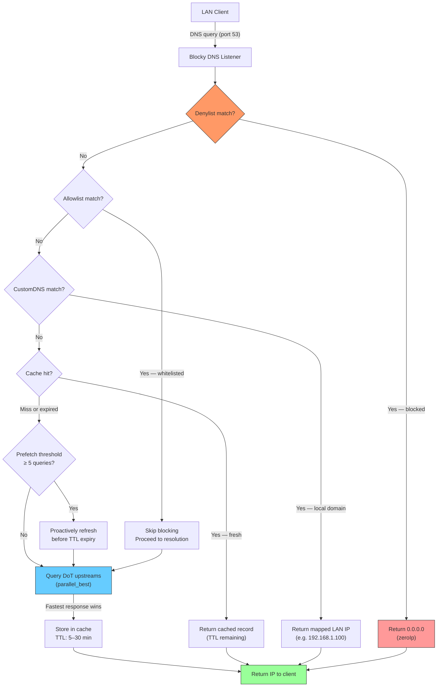
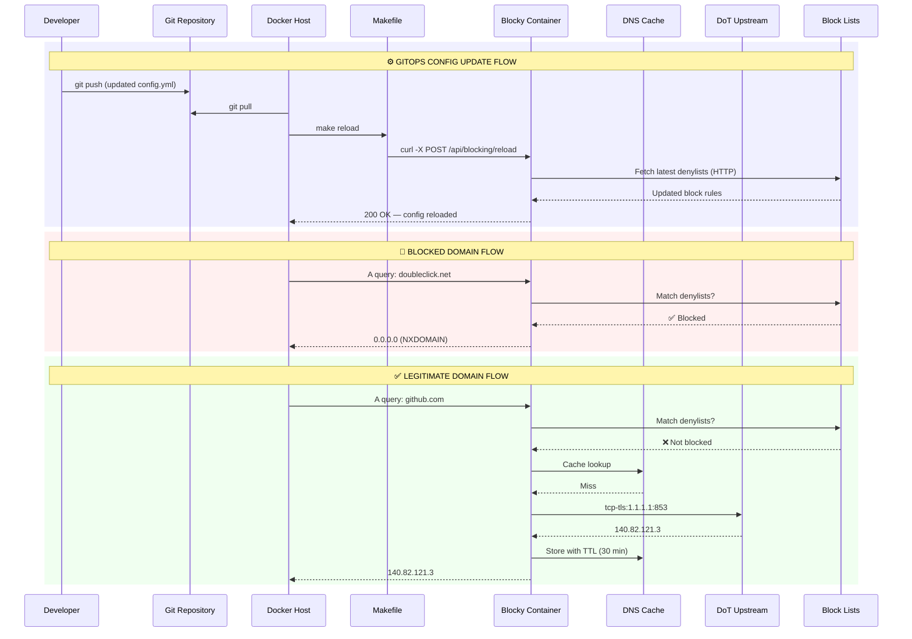
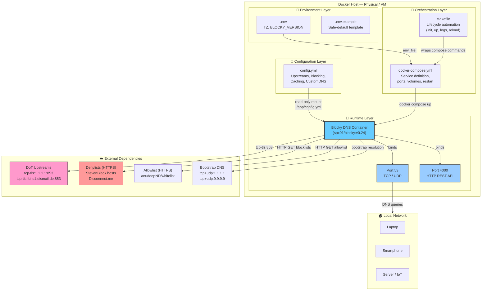

# 🛡️ Blocky DNS — GitOps-Powered Network-Level Ad Blocker

> **Privacy-first, DNS-level content filtering** — Blocky is a lightweight, high-performance DNS proxy that transforms any Docker host into a network-wide ad blocker and tracker sinkhole. This repository follows a **GitOps philosophy**: the entire DNS infrastructure is declared in code, version-controlled, and deployable with a single command.

---

## ✨ Key Features

- **DNS-over-TLS (DoT) Upstreams** — All queries to upstream resolvers are encrypted via `tcp-tls`, preventing eavesdropping and tampering.
- **Parallel Best-Response Strategy** — Queries are sent to multiple upstreams simultaneously; the fastest valid answer wins, minimising latency.
- **Ad & Tracker Blocking** — Community-maintained denylists (StevenBlack, Disconnect.me) are refreshed automatically; an allowlist prevents false positives.
- **Zero-IP Blocking** — Blocked domains resolve to `0.0.0.0` (`blockType: zeroIp`), instantly breaking connections for ads and trackers.
- **Intelligent DNS Caching** — Configurable TTL (5–30 min) with prefetching: popular entries are refreshed before they expire.
- **Hot-Reload API** — Configuration changes take effect immediately without container restart via `POST /api/blocking/reload`.
- **Custom LAN DNS** — Replace `/etc/hosts` across the entire network with declarative YAML mappings (`home.lan`, `proxmox.lan`, etc.).
- **GitOps Deployment** — Full lifecycle managed through a `Makefile`; `.env` and `config.yml` are the single source of truth.
- **Code Quality & Security** — YAML configuration linted for correctness; Docker image pinned to a specific version (`v0.24`); no exposed secrets in version control.

---

## 🧰 Technical Stack

| Component           | Technology                                     |
|---------------------|------------------------------------------------|
| DNS Proxy           | [Blocky](https://github.com/0xERR0R/blocky)    |
| Container Runtime   | Docker & Docker Compose v3.8                   |
| Upstream Protocol   | DNS-over-TLS (DoT) via `tcp-tls`               |
| Configuration       | YAML (GitOps — read-only mount)                |
| Secrets Management  | `.env` file (`.gitignore`-protected)           |
| Orchestration       | GNU Make                                       |
| Monitoring / Reload | HTTP REST API on port `4000`                   |

---

## 🚶 Diagram Walkthrough

The flowchart below captures the **high-level resolution pipeline** from the moment a LAN client issues a DNS query to the moment it receives a final answer. Every query passes through a deterministic chain: filtering, local lookup, cache, and — only when necessary — encrypted upstream resolution.



The pipeline enforces a strict **fail-over order**: blocklists take priority, then local overrides, then cache, and finally external DoT resolvers. This guarantees that blocked domains are never leaked upstream and that local LAN names never hit the public internet.

---

## 🗺️ System Workflow

The sequence diagram below illustrates two critical flows: the **GitOps configuration update cycle** (how a config change reaches the running service) and a typical **DNS resolution** session with both a blocked domain and a legitimate domain.



Three key observations from the workflow:

1. **GitOps-first design** — The `make reload` command triggers a hot reload via Blocky's HTTP API (`:4000/api/blocking/reload`), which fetches fresh blocklists from their remote URLs without any container restart.
2. **Zero-trust filtering** — Every domain passes through the denylist gate before anything else. Even if a previous query was cached, the filter is re-evaluated on every request.
3. **Parallel upstream resolution** — Blocky sends the query to all DoT upstreams simultaneously (`parallel_best` strategy). The first valid response wins, providing resilience against individual resolver failures and minimising latency.

---

## 🏗️ Architecture Components

The static architecture diagram reveals the layered structure: **environment → configuration → orchestration → container → external dependencies**. Every file in the repository maps to exactly one layer.



### Layer Responsibilities

| Layer           | Files                | Role                                                               |
|-----------------|----------------------|--------------------------------------------------------------------|
| Environment     | `.env`, `.env.example` | Parameterise the deployment (timezone, image version) without forking config |
| Configuration   | `config.yml`         | Single source of truth for all DNS behaviour — blocking, routing, caching |
| Orchestration   | `docker-compose.yml`, `Makefile` | Define, deploy, and manage the container lifecycle              |
| Runtime         | Blocky container     | Execute DNS resolution, enforce blocklists, serve API              |
| External        | —                    | Upstream resolvers, blocklist feeds, bootstrap DNS                 |
| LAN             | —                    | Network clients consuming the DNS service                          |

---

## ⚙️ Container Lifecycle

### Build Process

Since this project uses the official pre-built `spx01/blocky` image, there is no local Dockerfile. The "build" equates to image acquisition and configuration assembly:

```
1. Pull image   → docker pull spx01/blocky:v0.24  (pinned via BLOCKY_VERSION)
2. Validate env → make check-env  (ensures .env exists from .env.example)
3. Mount config → docker-compose.yml maps ./config.yml → /app/config.yml (ro)
4. Map ports    → Host :53 → Container :53  |  Host :4000 → Container :4000
5. Inject env   → TZ passed as environment variable
```

### Runtime Process

Once the container starts, Blocky follows this initialisation sequence before serving traffic:

```
┌─────────────────────────────────────────────────────────┐
│  Container start (restart: unless-stopped)              │
├─────────────────────────────────────────────────────────┤
│  1. Parse /app/config.yml                               │
│     ├── Validate YAML structure                          │
│     └── Apply defaults for missing optional fields       │
│                                                          │
│  2. Bootstrap DNS resolver                               │
│     └── Configure fallback resolvers (1.1.1.1, 9.9.9.9) │
│         for resolving upstream hostnames                 │
│                                                          │
│  3. Establish DoT upstream connections                   │
│     ├── tcp-tls:fdns1.dismail.de:853                     │
│     └── tcp-tls:1.1.1.1:853                              │
│                                                          │
│  4. Fetch remote blocklists (concurrent HTTP GET)        │
│     ├── StevenBlack hosts                                │
│     ├── Disconnect.me simple_ad                          │
│     └── anudeepND whitelist                              │
│                                                          │
│  5. Initialise in-memory DNS cache                       │
│     ├── Min TTL: 5m  |  Max TTL: 30m                     │
│     ├── Prefetching: ON  (threshold: 5 queries)          │
│     └── Negative cache TTL: 30m                          │
│                                                          │
│  6. Bind listeners                                       │
│     ├── DNS:  port 53 TCP+UDP   ← CLIENT TRAFFIC        │
│     └── HTTP: port 4000 TCP     ← ADMIN / RELOAD API     │
│                                                          │
│  7. Log ready state & enter event loop                   │
│     └── Serve queries | Maintain cache | Serve API       │
└─────────────────────────────────────────────────────────┘
```

The `unless-stopped` restart policy ensures the container automatically recovers from host reboots or unexpected crashes, making the DNS resolver effectively self-healing.

---

## 📂 File-by-File Guide

| File                | Purpose                                                                                                |
|---------------------|--------------------------------------------------------------------------------------------------------|
| `.env`              | Runtime secrets and parameters (timezone, image version); **gitignored** — never committed.            |
| `.env.example`      | Documented template with safe defaults; the canonical reference for any new deployment.                |
| `.gitignore`        | Prevents `.env`, IDE artifacts, swap files, and logs from polluting version control.                   |
| `config.yml`        | Sole Blocky configuration — upstreams, blocking rules, caching, custom DNS, ports, and logging.       |
| `docker-compose.yml`| Declares the Blocky service: image, ports (53, 4000), volumes (`config.yml` mounted read-only), env.   |
| `Makefile`          | Automation layer with targets: `init`, `up`, `down`, `restart`, `status`, `logs`, `reload`, `clean`.   |
| `README.md`         | This document — architectural overview, setup guide, and operational reference.                        |

---

## 📦 Installation & Setup

### Prerequisites

- Docker ≥ 20.10
- Docker Compose ≥ 2.x
- `make` (optional — manual `docker compose` commands also work)

### Quick Start

```bash
# 1. Clone the repository
git git@github.com:Selio30/imagenesDocker.git
cd imagenesDocker/blocky-dns

# 2. Initialise environment (creates .env from .env.example)
make init

# 3. Verify the service is running
make status
```

The `init` target validates the `.env` file, then deploys the stack. The DNS resolver is immediately available on `localhost:53`.

### Manual Setup (without Make)

```bash
cp .env.example .env
docker compose -p blocky-dns up -d
```

---

## 🚀 Usage

### Makefile Commands

| Command       | Description                                          |
|---------------|------------------------------------------------------|
| `make init`   | First-time deployment (validates `.env` then deploys)|
| `make up`     | Start the containers                                 |
| `make down`   | Stop the containers                                  |
| `make restart`| Restart the container                                |
| `make status` | Show container status (`docker compose ps`)          |
| `make logs`   | Tail the last 50 log lines in real time              |
| `make reload` | Hot-reload `config.yml` via the HTTP API             |
| `make clean`  | Stop and remove orphaned containers                  |

### Smoke Test

Verify the resolver is working:

```bash
dig @localhost google.com
nslookup google.com localhost
```

Confirm ad blocking:

```bash
dig @localhost doubleclick.net
# Expected: 0.0.0.0 (blocked)
```

---

## ⚙️ Configuration

### Environment Variables (`.env`)

```env
# Timezone for container logs and timestamps
TZ=Europe/Madrid

# Pinned Blocky release (avoid "latest" in production)
BLOCKY_VERSION=v0.24
```

> **Security note:** `.env` is listed in `.gitignore`. Never commit real credentials. Use `.env.example` as the template for new deployments.

### Blocky Configuration (`config.yml`)

| Section           | Purpose                                               |
|-------------------|-------------------------------------------------------|
| `upstreams`       | DoT resolver endpoints and parallel resolution policy |
| `bootstrapDns`    | Fallback resolvers for upstream hostname resolution   |
| `blocking`        | Denylists, allowlists, client groups, and block type  |
| `customDNS`       | Static DNS mappings for local LAN                     |
| `caching`         | TTL ranges, prefetching threshold, negative caching   |
| `ports`           | DNS (53) and HTTP API (4000) listeners                |
| `log`             | Log level, format, and timestamping                   |

Changes take effect immediately via:

```bash
make reload
# Or directly:
curl -X POST http://localhost:4000/api/blocking/reload
```

---

## 🔒 Security & Resilience

- **DoT Encryption** — Upstream queries are never sent in plaintext.
- **Bootstrap DNS** — Hardcoded fallback resolvers (`1.1.1.1`, `9.9.9.9`) ensure Blocky can always resolve upstream hostnames, even if the system DNS is compromised or misconfigured.
- **Read-Only Config Mount** — The container cannot modify `config.yml`; all changes flow through Git, enforcing auditability.
- **Pinned Version** — `BLOCKY_VERSION=v0.24` eliminates surprise breaking changes from `latest`.
- **Restart Policy** — `unless-stopped` ensures the DNS resolver survives host reboots.

---

## 🧪 Code Quality & Standards

- **YAML Linting** — Configuration files follow strict YAML formatting conventions.
- **Docker Best Practices** — Single-service Compose file with explicit port mapping, read-only volumes, and pinned image tags.
- **GitOps Hygiene** — `.env` is gitignored; `.env.example` serves as the documented template. No secrets enter the repository.
- **Bandit / Pylint (target)** — Future Python-based tooling (e.g., test harnesses, config validators) will target **Pylint > 9.5/10** and **zero Bandit findings** as quality gates.

---

## 🗺 Roadmap

- [ ] Additional blocklist support (OISD, AdGuard DNS filter)
- [ ] Prometheus metrics scraping integration (port `4000`)
- [ ] Terraform / Ansible provisioning for multi-host deployments
- [ ] Python-based integration test suite with Pylint & Bandit CI gates

---

## Author

**Sergio Barbero — Selio30**  
[LinkedIn](https://www.linkedin.com/in/Selio30/)
