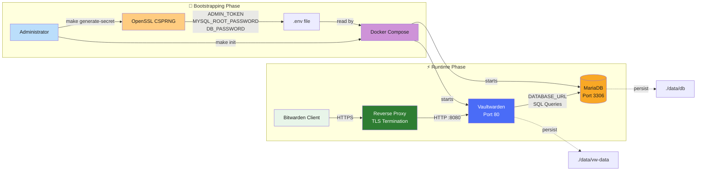
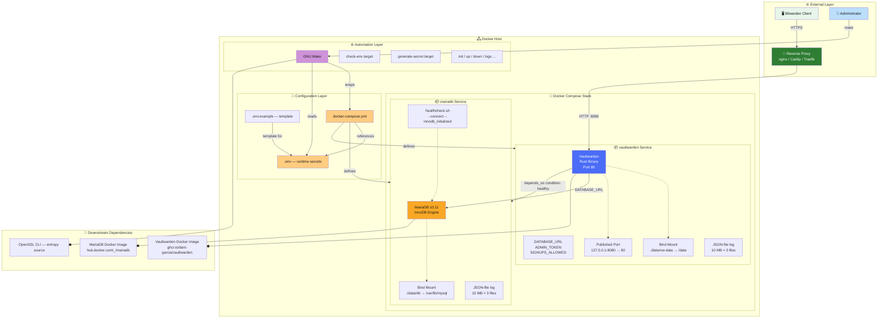

# 🛡️ Vaultwarden — Self-Hosted Password Vault

**Vaultwarden** is a lightweight, self-hosted password manager compatible with Bitwarden clients. This repository provides a production-grade Docker Compose stack pairing the [Vaultwarden](https://github.com/dani-garcia/vaultwarden) server (Rust) with a **MariaDB 10.11** database, hardened defaults, and a cryptographic secret bootstrapping pipeline.

Deploy your own private vault in minutes — no telemetry, no third-party dependency, full data sovereignty.

---

## 🚶 Diagram Walkthrough

The following flowchart captures the **high-level execution path**, from administrator bootstrapping to runtime request handling.



**Two distinct phases:**

| Phase | Actors | Description |
|-------|--------|-------------|
| **Bootstrapping** | Administrator, Make, OpenSSL, Docker Compose | Secret generation, `.env` validation, container provisioning |
| **Runtime** | Bitwarden Client, Reverse Proxy, Vaultwarden, MariaDB | TLS-terminated requests, SQL query execution, data persistence |

---

## 🗺️ System Workflow

The sequence diagram below walks through the **complete lifecycle** — from secret generation through a production request.

```mermaid
sequenceDiagram
    participant Admin
    participant Make as GNU Make
    participant Docker as Docker Compose
    participant MariaDB
    participant VW as Vaultwarden
    participant Client

    rect rgb(230, 240, 255)
        Note over Admin,Make: 🔐 BOOTSTRAPPING
        Admin->>Make: make generate-secret
        Make->>Make: cp .env.example .env (if missing)
        Make->>OpenSSL: openssl rand -base64 48 (ADMIN_TOKEN)
        Make->>OpenSSL: openssl rand -base64 32 (MYSQL_ROOT_PASSWORD)
        Make->>OpenSSL: openssl rand -base64 24 (DB_PASSWORD)
        OpenSSL-->>Make: raw entropy
        Make->>Make: escape / and & via sed
        Make->>.env: inject ADMIN_TOKEN
        Make->>.env: inject MYSQL_ROOT_PASSWORD
        Make->>.env: inject DB_PASSWORD
        Note over Admin,Make: ✓ Secrets written
    end

    rect rgb(232, 245, 233)
        Note over Admin,Docker: 🚀 DEPLOYMENT
        Admin->>Make: make init
        Make->>Make: check-env — validate .env
        alt .env has CHANGE_ME or empty values
            Make-->>Admin: ❌ ERROR — run make generate-secret first
        end
        Make->>Docker: docker compose -p vaultwarden-vault up -d
        Docker->>MariaDB: create + start container
        MariaDB->>MariaDB: initialize InnoDB
        MariaDB->>MariaDB: healthcheck.sh --connect --innodb_initialized
        Note over MariaDB: interval=10s, timeout=5s, retries=5
        MariaDB-->>Docker: ✅ healthy
        Docker->>VW: start container (depends_on: mariadb healthy)
        VW->>MariaDB: connect via DATABASE_URL
        MariaDB-->>VW: ✅ connection established
        Docker-->>Make: stack running
        Make-->>Admin: ✅ Stack Vaultwarden deployed
    end

    rect rgb(255, 243, 224)
        Note over Client,VW: 🌐 RUNTIME REQUEST
        Client->>+RP[Reverse Proxy]: HTTPS — /api/cipher
        RP->>+VW: HTTP 127.0.0.1:8080
        VW->>VW: authenticate (ADMIN_TOKEN / user session)
        VW->>+MariaDB: SELECT/INSERT cipher data
        MariaDB-->>-VW: result set
        VW-->>-RP: JSON response
        RP-->>-Client: HTTPS response
    end
```

**Operation notes:**

- MariaDB health checks run every **10 seconds**; Vaultwarden waits for a **healthy** status before starting.
- The reverse proxy is **not** part of the Docker Compose stack — it runs externally and must be configured separately.
- All three secrets are generated from the same OpenSSL CSPRNG but with different entropy lengths (48 / 32 / 24 bytes).

---

## 🏗️ Architecture Components

The C4-style component diagram below illustrates the **static structure** of every layer in the system.



**Dependency summary:**

| Layer | Component | Depends On |
|-------|-----------|------------|
| Automation | GNU Make | OpenSSL CLI, Docker Compose |
| Configuration | `.env`, `docker-compose.yml` | GNU Make (for generation) |
| Container (DB) | MariaDB 10.11 | Official Docker image, bind-mounted volume |
| Container (App) | Vaultwarden | MariaDB (healthy), official image, bind-mounted volume |
| Network | Reverse Proxy | Vaultwarden port `:8080` (loopback) |

---

## ⚙️ Container Lifecycle

### Build Process

This stack consumes **pre-built, officially published Docker images** — no custom `Dockerfile` is required.

```bash
# Pull the latest images referenced in docker-compose.yml
docker compose pull

# Or pin a specific version already defined in .env:
#   VAULTWARDEN_TAG=1.30.5
docker compose pull vaultwarden
```

| Image | Source | Pinning |
|-------|--------|---------|
| `mariadb:10.11` | Docker Hub (`library/mariadb`) | Fixed by tag in compose |
| `vaultwarden/server:${VAULTWARDEN_TAG}` | GitHub Container Registry (`ghcr.io/dani-garcia/vaultwarden`) | Pinned via `.env` variable |

There are **no intermediate build stages**, no multi-stage Dockerfiles, and no compilation steps. The stack is entirely assembly-of-artefacts.

### Runtime Process

Each container follows a deterministic startup sequence:

```mermaid
flowchart LR
    subgraph MariaDB_Start["📦 MariaDB Startup"]
        A1[Container start] --> A2[InnoDB init<br/>/var/lib/mysql]
        A2 --> A3[Create DB + User<br/>from env vars]
        A3 --> A4[healthcheck.sh loop<br/>every 10s]
        A4 -->|innodb_initialized<br/>&& tcp connect| A5[✅ healthy]
    end

    subgraph Vaultwarden_Start["📦 Vaultwarden Startup"]
        B1[Container start] --> B2[Read DATABASE_URL<br/>from env]
        B2 --> B3[TCP connect to<br/>mariadb:3306]
        B3 --> B4[Run DB migrations<br/>(embedded)]
        B4 --> B5[Load admin token<br/>Load config]
        B5 --> B6[Bind port 80<br/>✅ ready]
    end

    A5 -->|depends_on| B1

    style A5 fill:#81c784,color:#1a1a1a
    style B6 fill:#81c784,color:#1a1a1a
```

**MariaDB startup sequence:**
1. Container starts, entrypoint runs `docker-entrypoint.sh`
2. If `/var/lib/mysql` is empty, InnoDB bootstrap runs (initializes `mysql`, `sys`, and the user-defined database)
3. Environment variables `MYSQL_ROOT_PASSWORD`, `MYSQL_DATABASE`, `MYSQL_USER`, `MYSQL_PASSWORD` are evaluated — database and user are created
4. The built-in `healthcheck.sh` begins polling every 10 seconds (`--connect --innodb_initialized`)
5. Container reports **healthy** once InnoDB is fully initialized and TCP connections succeed

**Vaultwarden startup sequence:**
1. Container starts; the Rust binary evaluates environment variables
2. Parses `DATABASE_URL` and attempts a TCP connection to `mariadb:3306`
3. Runs embedded database migrations (schema creation / upgrades)
4. Loads `ADMIN_TOKEN` for `/admin` authentication and `SIGNUPS_ALLOWED` policy
5. Binds to `0.0.0.0:80` (mapped to `127.0.0.1:8080` on the host)
6. Begins accepting HTTP requests — **ready**

---

## 📂 File-by-File Guide

| Path | Purpose |
|------|---------|
| `docker-compose.yml` | Declares the two services (`mariadb`, `vaultwarden`), their images, environment variables, volumes, ports, health checks, logging, and inter-service dependency ordering |
| `Makefile` | Automation façade over Docker Compose — provides `generate-secret`, `init`, `up`, `down`, `restart`, `status`, `logs`, `clean`, and `check-env` targets with coloured terminal output and pre-flight validation |
| `.env.example` | Documented template of all environment variables; acts as a checklist for manual setup and as the seed for `make generate-secret` |
| `.gitignore` | Prevents accidental commits of `.env` (secrets), `.DS_Store` (macOS metadata), `*.log` files, and the entire `data/` directory (database + vault state) |
| `data/db/` | MariaDB data directory (auto-created by Docker as root-owned bind mount) — contains InnoDB tablespaces, binary logs, and the MySQL grant tables |
| `data/vw-data/` | Vaultwarden data directory (auto-created) — stores `config.json`, `db.sqlite3` (if overridden), icon cache, and attachments |
| `README.md` | This file — architecture documentation, runbook, and entry point for new developers and security auditors |

---

## Key Features

- **Bitwarden-compatible** — Use any official Bitwarden client (web, desktop, mobile, browser extension).
- **MariaDB-backed** — Persistent, transaction-safe storage with automatic health checks.
- **Hardened by default** — Sign-ups disabled, admin token required, credentials never shared.
- **Separated database credentials** — Application user (`DB_PASSWORD`) and MariaDB root (`MYSQL_ROOT_PASSWORD`) use distinct, independently generated secrets.
- **Cryptographic secret bootstrapping** — `make generate-secret` produces cryptographically strong tokens via OpenSSL CSPRNG.
- **Fail-fast validation** — Every required environment variable (`ADMIN_TOKEN`, `DB_PASSWORD`, `MYSQL_ROOT_PASSWORD`) is enforced with Docker Compose's `${VAR:?}` syntax.
- **Loopback-bound** — Vaultwarden listens on `127.0.0.1:8080` only; a reverse proxy with TLS is required for external access.
- **Structured logging** — JSON-file driver with rotation (10 MB per file, max 3 files).

---

## Technical Stack

| Component          | Technology                                      |
|--------------------|-------------------------------------------------|
| **Secret Vault**   | [Vaultwarden](https://github.com/dani-garcia/vaultwarden) (Rust) |
| **Database**       | MariaDB 10.11                                   |
| **Orchestration**  | Docker Compose v2                               |
| **Automation**     | GNU Make                                        |
| **Secret Gen.**    | OpenSSL CLI (`rand -base64`)                    |
| **Health Checks**  | MariaDB `healthcheck.sh` (built-in)             |

---

## Installation & Setup

### Prerequisites

- **Docker** ≥ 24.x (with Compose v2 plugin)
- **Make** ≥ 4.x
- **OpenSSL** (for secret generation)
- A **reverse proxy** (Caddy, Nginx, Traefik) with TLS termination if exposing beyond localhost.

### Quick Start

```bash
# 1. Clone the repository
git clone git@github.com:Selio30/imagenesDocker.git
cd imagenesDocker/Redes_y_Seguridad/Vaultwarden

# 2. Bootstrap cryptographically strong secrets
#    (creates .env from .env.example and injects ADMIN_TOKEN,
#     MYSQL_ROOT_PASSWORD, and DB_PASSWORD)
make generate-secret

# 3. Inspect the generated .env
cat .env

# 4. Deploy the stack
make init

# 5. Verify both services are healthy
make status
```

> **Important:** Never commit `.env`. The `.gitignore` already excludes it.

### Manual Setup

If you prefer to configure variables by hand:

```bash
cp .env.example .env
# Edit .env — replace ALL CHANGE_ME_* values with strong secrets
nano .env
make init
```

---

## Configuration

### Environment Variables

| Variable                          | Required | Default          | Description                                        |
|-----------------------------------|----------|------------------|----------------------------------------------------|
| `VAULTWARDEN_TAG`                 | No       | `latest`         | Vaultwarden Docker image tag                       |
| `ADMIN_TOKEN`                     | **Yes**  | —                | Authentication token for `/admin` panel            |
| `SIGNUPS_ALLOWED`                 | No       | `false`          | Allow public registration                          |
| `DB_USER`                         | No       | `vaultwarden`    | MariaDB application user                           |
| `DB_NAME`                         | No       | `vaultwarden`    | MariaDB database name                              |
| `DB_PASSWORD`                     | **Yes**  | —                | Password for the application database user         |
| `MYSQL_ROOT_PASSWORD`             | **Yes**  | —                | MariaDB root password (separate from DB_PASSWORD)  |

All required variables use Docker Compose's `${VAR:?error}` syntax to **fail immediately** if unset — never silently default to empty.

### Recommended Reverse Proxy Configuration

Because Vaultwarden is bound to `127.0.0.1:8080`, you **must** place a TLS-terminating reverse proxy in front for any external access. Example snippet for Caddy:

```
vault.example.com {
    reverse_proxy 127.0.0.1:8080
}
```

---

## Usage

### Makefile Commands

| Command             | Description                                    |
|---------------------|------------------------------------------------|
| `make help`         | Display available targets                      |
| `make generate-secret` | Generate cryptographically strong secrets and write them to `.env` |
| `make init`         | Validate `.env` and deploy the full stack      |
| `make up`           | Validate `.env` and start containers           |
| `make down`         | Stop containers                                |
| `make restart`      | Restart all services                           |
| `make status`       | Show container status (`docker compose ps`)    |
| `make logs`         | Tail Vaultwarden logs (last 50 lines, follow)  |
| `make clean`        | Stop and remove orphan containers              |

### Typical Workflow

```bash
# First deployment
make generate-secret
make init

# Daily operations
make status
make logs

# Update Vaultwarden (change VAULTWARDEN_TAG in .env first)
make down
make up

# Rotate secrets (regenerates ADMIN_TOKEN, MYSQL_ROOT_PASSWORD, DB_PASSWORD)
make generate-secret
make restart
```

---

## Security Considerations

- **Loopback binding** prevents direct exposure; always use a reverse proxy with TLS.
- **Separated root / app credentials** limit the blast radius if the application user is compromised.
- **Sign-ups disabled** by default — users must be invited via the `/admin` panel.
- **Admin token** is required to access the administrative interface.
- **No secrets in git** — `.env` is in `.gitignore`; the example file contains only placeholder values.
- **Automated secret rotation** — `make generate-secret` replaces all three secrets atomically.
- **Log rotation** prevents disk exhaustion (10 MB × 3 files per container).

---

## Author

**Sergio Barbero — Selio30**  
[LinkedIn](https://www.linkedin.com/in/Selio30)
