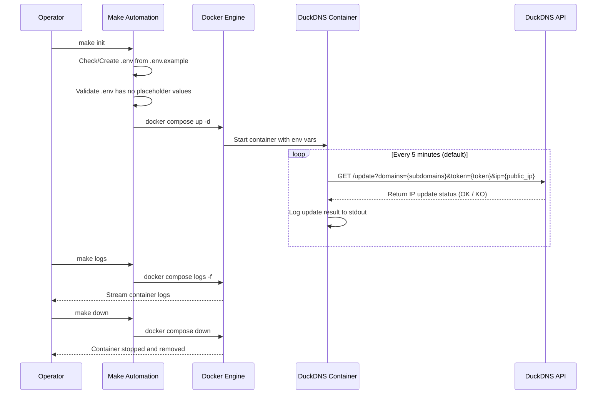

# DuckDNS Dynamic IP Updater
## Enterprise-Grade Dockerized Dynamic DNS Management

A lightweight, production-ready solution for automating DuckDNS subdomain IP updates using Docker containers. Designed for reliability, security, and operational simplicity in home lab, self-hosted, and edge computing environments.

---

## Project Identity

**DuckDNS Dynamic IP Updater** is a containerized automation tool that maintains real-time synchronization between your dynamic public IP address and DuckDNS subdomains. Built on Alpine-based images with zero Python overhead, it delivers a minimal-attack-surface solution for continuous DNS record management without custom application code or runtime dependencies.

---

## Key Features

- **Zero-Configuration Deployment**: Single-command setup via Makefile with environment validation
- **Secure Credential Management**: Sensitive tokens and subdomains isolated in `.env` (git-ignored)
- **Lightweight Containerization**: Uses trusted `lscr.io/linuxserver/duckdns` image with minimal overhead
- **Operational Simplicity**: Full lifecycle management via Makefile (init, up, down, logs, clean)
- **Network Resilience**: Host network mode for direct public IP detection without NAT complexity
- **Restart Policy**: Automatic container recovery with `unless-stopped` restart policy
- **Non-Root Execution**: Container runs as unprivileged user (PUID 1000 / PGID 1000)
- **Code Quality Assurance**: While this is a shell-based container project (no Python), the repository enforces high standards through Makefile validation and Docker image provenance checks. For Python-based extensions, Pylint > 9.5 and Bandit security linting are recommended as future quality gates.

---

## Technical Stack

| Technology | Purpose | Version / Source |
|------------|---------|------------------|
| **Docker** | Container runtime | 29.4.0+ |
| **Docker Compose** | Container orchestration | v5.1.2+ |
| **Alpine Linux** | Base image OS (via linuxserver/duckdns) | Latest |
| **GNU Make** | Build automation & lifecycle management | 4.3+ |
| **Bash** | Container update script runtime | Alpine default |
| **DuckDNS API** | Dynamic DNS update endpoint | https://www.duckdns.org |

> **Note**: Python-specific tooling (Pylint, Bandit, Loguru, Pytest) is not applicable to this shell-based container project. These tools are referenced here as quality standards for any future Python component contributions.

---

## Installation & Setup

### Prerequisites

- Docker and Docker Compose installed and running
- DuckDNS account with valid token ([obtain here](https://www.duckdns.org/))
- Registered subdomains on DuckDNS

### Step-by-Step Deployment

1. **Clone the repository**
   ```bash
   git clone git@github.com:Selio30/imagenesDocker.git
   cd imagenesDocker/duckdns
   ```

2. **Initialize environment**
   ```bash
   make init
   ```
   This copies `.env.example` to `.env` automatically and validates configuration.

3. **Configure credentials**
   Edit the newly created `.env` file with your actual values:
   ```bash
   nano .env
   ```
   Update:
   ```env
   TOKEN=your_actual_duckdns_token_here
   SUBDOMAINS=your_subdomain1,your_subdomain2
   TZ=Europe/Madrid
   ```

4. **Deploy the service**
   ```bash
   make up
   ```
   (Or run `make init` again after configuring `.env` to start the container)

---

## Architecture & Workflow

### File Tree

```
duckdns/
├── docker-compose.yml       # Container orchestration configuration
├── Makefile                 # Build and lifecycle automation
├── .env.example             # Template for environment variables
├── .gitignore               # Protects .env and local artifacts from version control
├── LICENSE                  # MIT License
└── README.md                # Project documentation
```

### System Workflow



### Conceptual Data Flow

1. **Ingestion**: The `linuxserver/duckdns` container reads environment variables (`TOKEN`, `SUBDOMAINS`, `TZ`) at runtime.
2. **Detection**: A built-in script queries the public IP address via external services (ipify or similar).
3. **Update**: The script issues an HTTP GET to `https://www.duckdns.org/update` with the detected IP and credentials.
4. **Persistence**: DuckDNS updates the DNS A record for the specified subdomains.
5. **Logging**: The operation result is emitted to stdout, accessible via `docker compose logs`.

---

## Configuration

### Environment Variables (`.env`)

| Variable | Description | Example | Required |
|----------|-------------|---------|----------|
| `TOKEN` | DuckDNS account token (sensitive, keep secret) | `a1b2c3d4-5e6f-7g8h-9i0j-k1l2m3n4o5p6` | Yes |
| `SUBDOMAINS` | Comma-separated subdomain names (without `.duckdns.org`) | `bauldejardin,instantanea` | Yes |
| `TZ` | Timezone for log timestamps | `Europe/Madrid` | Yes |

### Docker Compose Configuration

The `docker-compose.yml` uses:
- `env_file` directive to inject `.env` variables securely into the container
- Host network mode (`network_mode: host`) for direct public IP detection without NAT traversal
- Non-root execution with `PUID=1000` and `PGID=1000`
- `LOG_FILE=false` to disable internal file logging (stdout only)
- `restart: unless-stopped` for automatic recovery after reboots or failures

---

## Usage

### Makefile Commands

```bash
# Show available commands with descriptions
make help

# Full initialization (first run: create .env + validate + deploy)
make init

# Start the service (requires configured .env)
make up

# Restart the running service
make restart

# Stop and remove the container
make down

# View real-time logs (last 50 lines)
make logs

# Check container status
make status

# Full cleanup (stop + remove orphans)
make clean
```

### Manual Docker Commands

```bash
# Start container
docker compose up -d

# View logs
docker compose logs -f --tail=50

# Stop container
docker compose down

# Check status
docker compose ps
```

---

## Security Considerations

1. **Credential Protection**: `.env` is permanently git-ignored to prevent token leakage in version control.
2. **Non-Root Execution**: Container runs as unprivileged user (UID/GID 1000), reducing privilege escalation risk.
3. **Minimal Image**: Uses Alpine-based DuckDNS image with reduced attack surface and regular security updates.
4. **No Port Exposure**: Host network mode avoids unnecessary port mapping to the host interface.
5. **Token Isolation**: DuckDNS tokens are passed via environment files, never hardcoded or logged.
6. **Supply Chain**: Base image sourced from `lscr.io/linuxserver`, a trusted community-maintained registry with automated builds.

---

## Author

**Sergio Barbero - Selio30**  
[LinkedIn Profile](https://www.linkedin.com/in/selio30)

---

*Last Updated: 2026-05-06*  
*Project Version: 1.0.0*  
*License: MIT*
