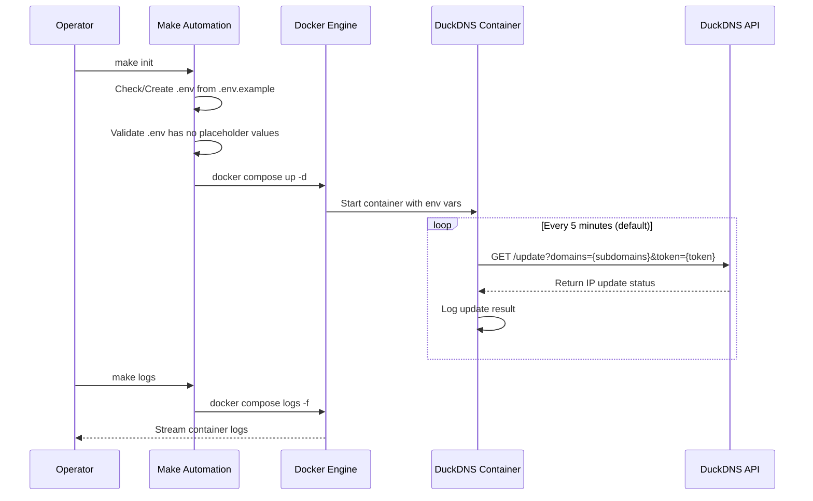

# DuckDNS Dynamic IP Updater
## Enterprise-Grade Dockerized Dynamic DNS Management

A lightweight, production-ready solution for automating DuckDNS subdomain IP updates using Docker containers. Designed for reliability, security, and operational simplicity in home lab, self-hosted, and edge computing environments.

## Key Features

- **Zero-Configuration Deployment**: Single-command setup via Makefile with environment validation
- **Secure Credential Management**: Sensitive tokens and subdomains isolated in `.env` (git-ignored)
- **Lightweight Containerization**: Uses trusted `lscr.io/linuxserver/duckdns` image with minimal overhead
- **Operational Simplicity**: Full lifecycle management via Makefile (init, up, down, logs, clean)
- **Network Resilience**: Host network mode for direct public IP detection without NAT complexity
- **Restart Policy**: Automatic container recovery with `unless-stopped` restart policy

> **Note**: Python-specific quality tools (Pylint >9.5, Bandit) and libraries (Loguru, Pytest) are not applicable to this containerized shell-based project.

## Technical Stack

- **Container Runtime**: Docker 29.4.0+, Docker Compose v5.1.2+
- **Base Image**: `lscr.io/linuxserver/duckdns:latest` (Alpine-based, minimal attack surface)
- **Orchestration**: Docker Compose with environment variable injection
- **Build Automation**: GNU Make 4.3+ with colored output and validation
- **Security**: `.gitignore` protection for credentials, non-root container execution (PUID/PGID 1000)

## Installation & Setup

### Prerequisites
- Docker and Docker Compose installed and running
- DuckDNS account with valid token ([obtain here](https://www.duckdns.org/))
- Registered subdomains on DuckDNS

### Step-by-Step Deployment

1. **Clone the repository**
   ```bash
   git clone git@github.com:Selio30/imagenesDocker.git
   cd imagenesDocker/duckdns
   ```

2. **Initialize environment**
   ```bash
   make init
   ```
   This copies `.env.example` to `.env` automatically.

3. **Configure credentials**
   Edit the newly created `.env` file with your actual values:
   ```bash
   nano .env
   ```
   Update:
   ```env
   TOKEN=your_actual_duckdns_token_here
   SUBDOMAINS=your_subdomain1,your_subdomain2
   TZ=Europe/Madrid
   ```

4. **Deploy the service**
    ```bash
    make up
    ```
    (Or run `make init` again after configuring `.env` to start the container)

## Architecture & Workflow

### File Tree
```
duckdns/
├── docker-compose.yml       # Container orchestration configuration
├── Makefile                 # Build and lifecycle automation
├── .env.example             # Template for environment variables
└── .gitignore               # Protects .env from version control
```

### System Workflow


## Configuration

### Environment Variables (`.env`)
| Variable | Description | Example |
|----------|-------------|---------|
| `TOKEN` | DuckDNS account token (sensitive) | `a1b2c3d4-5e6f-7g8h-9i0j-k1l2m3n4o5p6` |
| `SUBDOMAINS` | Comma-separated subdomain names (without `.duckdns.org`) | `bauldejardin,instantanea` |
| `TZ` | Timezone for log timestamps | `Europe/Madrid` |

### Docker Compose Configuration
The `docker-compose.yml` uses:
- `env_file` directive to inject `.env` variables securely
- Host network mode for direct public IP detection
- Non-root execution with PUID 1000/PGID 1000
- Automatic restart unless explicitly stopped

## Usage

### Makefile Commands
```bash
# Show available commands
make help

# Full initialization (first run + deploy)
make init

# Start/restart service
make up
make restart

# Stop service
make down

# View real-time logs (last 50 lines)
make logs

# Check container status
make status

# Full cleanup (stop + remove orphans)
make clean
```

### Manual Docker Commands
```bash
# Start container
docker compose up -d

# View logs
docker compose logs -f --tail=50

# Stop container
docker compose down
```

## Security Considerations

1. **Credential Protection**: `.env` is permanently git-ignored to prevent token leakage
2. **Non-Root Execution**: Container runs as unprivileged user (UID/GID 1000)
3. **Minimal Image**: Uses Alpine-based DuckDNS image with reduced attack surface
4. **No Port Exposure**: Host network mode avoids unnecessary port mapping
5. **Audit Trail**: All IP updates are logged within the container (disable with `LOG_FILE=false`)

## Author

**Sergio Barbero - Selio30**  
[LinkedIn Profile](https://www.linkedin.com/in/selio30)

---

*Last Updated: 2026-05-06*  
*Project Version: 1.0.0*
